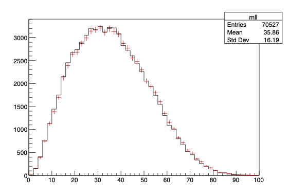

Coherent data analysis interface in C++.

# Features
- Manipulation of any data types as column values.
- Arbitrary action execution and results retrieval.
- Propagation of systematic variations.
- Multithreaded processing of the dataset.

# Introduction

A clear _abstraction_ layer to define dataset transformation procedures helps ensure the technical robustness of an analysis, as well as its reproducibility and extensibility as the project develops.

- The `analysis` entity represents the dataset to be analyzed.
- Any operation returns a `lazy` node representing the action to be performed.
  - Further operations can be performed in the context of existing ones.
- A node can be `varied`, meaning alternate versions of the action is performed in the analysis.
  - The outcome of both the nominal and varied actions are available side-by-side.

# Prerequisites
- C++17 compiler (tested with Clang 14 and GCC 11)
- CMake 3.24 or newer

# Including `ana` 

1. Clone this repository.
2. Add `ana/include` to the include path:
3. `#include "ana/abc.h"` to implement components.
4. `#include "ana/analysis.h"` to do data analysis.

# Walkthrough

The following example uses an implementation of the interface (see [here](github.com/taehyounpark/rootana.git)) for the [CERN ROOT framework](https://root.cern/) to analyze physics collision dataset reconstructing the Higgs boson transverse momentum in simulated $H\rightarrow WW^{\ast}\rightarrow e\nu\mu\nu$ events (publicly available [here](https://opendata.cern.ch/record/700)).

## 0. Opening the dataset

Specify the multithreading configuration and the input dataset of the analysis as the following:

```cpp
// enable (or disable) multithreading
ana::multithread::enable(/* 10 */);  // provide thread count (default: system maximum)

// Tree is user-implemented
auto hww = ana::analysis<Tree>({"ds.root"}, "mini");
```

## 1. Computing quantities of interest

A computation graph of `column`s, as created below, is guaranteed to be:
- Recursion-free, as the grammar forbids this by construction.
- No-copy of column values passed from one another, unless a conversion is required.

### 1.1 Reading columns in the dataset
Existing columns in the dataset can be accessed by supplying their types and names.
```cpp
using VecUI = ROOT::RVec<unsigned int>;
using VecF = ROOT::RVec<float>;
using VecD = ROOT::RVec<float>;

// Tree::Branch<T> is user-implemented
auto mc_weight = data.read<float>("mcWeight");
auto el_sf = data.read<float>("scaleFactor_ELE");
auto mu_sf = ds.read<float>("scaleFactor_MUON");
auto lep_pt_MeV = ds.read<VecF>("lep_pt");
auto lep_eta = ds.read<VecF>("lep_eta");
auto lep_phi = ds.read<VecF>("lep_phi");
auto lep_E_MeV = ds.read<VecF>("lep_E");
auto lep_Q = ds.read<VecF>("lep_charge");
auto lep_type = ds.read<VecUI>("lep_type");
auto met_MeV = ds.read<float>("met_et");
auto met_phi = ds.read<float>("met_phi");
```

### 1.2 Computing new quantities
### Simple expressions
Mathematical binary and unary operations available for the underlying data types are supported:
```cpp
auto GeV = ana.constant(1000.0);
auto lep_pt = lep_pt_MeV / GeV;
// (lep_E, met, ...)

auto lep_eta_max = ds.constant(2.4);
auto lep_pt_sel = lep_pt[ lep_eta < lep_eta_max && lep_eta > (-lep_eta_max) ];
// (lep_eta_sel, lep_phi_sel, lep_E_sel, ...)
```
(Shorthand operators, such as `+=`, are not supported).

To access non-trivial methods of the underlying data, any function can be used.
```cpp
using P4 = TLorentzVector;

//  dilepton four-momentum
auto p4ll = ds.define([](P4 const& p4, P4 const& q4){return (p4+q4);})(l1p4,l2p4);

// (dilepton+MET) transverse momentum
auto pth = ds.define(
  [](const P4& p3, float q, float q_phi){
    TVector2 p2; p2.SetMagPhi(p3.Pt(), p3.Phi());
    TVector2 q2; q2.SetMagPhi(q, q_phi);
    return (p2+q2).Mod();
  })(p4ll, met, met_phi);
```
### Custom definitions
Complex computations can be fully specified by implementing a `definition`. 
```cpp
// define an ith TLorenzVector out of (pt,eta,phi,e) vectors
class NthP4 : public ana::column::definition<P4(VecD, VecD, VecD, VecD)>
{
public:
  NthP4(unsigned int index) : 
    m_index(index)
  {}
  virtual ~NthP4() = default;

  // implement this
  virtual P4 evaluate(ana::observable<VecD> pt, ana::observable<VecD> eta, ana::observable<VecD> phi, ana::observable<VecD> es) const override {
    P4 p4; p4.SetPtEtaPhiE(pt->at(m_index),eta->at(m_index),phi->at(m_index),es->at(m_index));
    return p4;
  }
  // (ana::observable<T> handles conversion/inheritance between compatible types)

// important: it is up to implementation to ensure thread-safety
protected:
  unsigned int m_index;
  // int* g_modifiable_global_var;  // <- bad idea
};
```

Combining the above methods:
```cpp
// first- & second-leading lepton four-momenta
auto l1p4 = ds.define<NthP4>(0)(lep_pt_sel, lep_eta_sel, lep_phi_sel, lep_E_sel);
auto l2p4 = ds.define<NthP4>(1)(lep_pt_sel, lep_eta_sel, lep_phi_sel, lep_E_sel);

// dilepton four-momentum
auto p4ll = l1p4+l2p4;

// dilepton invariant mass
auto mll = ds.define([](const P4& p4){return p4.M();})(p4ll);

// dilepton+MET(=higgs) transverse momentum
auto pth = ds.define(
  [](const P4& p4, float q, float q_phi) {
    TVector2 p2; p2.SetMagPhi(p4.Pt(), p4.Phi());
    TVector2 q2; q2.SetMagPhi(q, q_phi);
    return (p2+q2).Mod();
  })(p4ll, met, met_phi);
```
### (Advanced) Column representations

For cases in which values of multiple columns in a dataset correspond to attributes of a parent entity, such conceptual models can be accommodated by a `representation`
```cpp
// example: not used in rest of walkthrough
enum class LeptonProperty { LV, Q, TYPE };
class Lepton : public ana::column::representation<Lepton(P4,int,unsigned int)>
{
public:
  Lepton() = default;
  virtual ~Lepton() = default;
  bool getP4()      { return this->value<LeptonProperty::LV>(); }
  bool getCharge()  { return this->value<LeptonProperty::Q>(); }
  bool isElectron() { return this->value<LeptonProperty::TYPE>() == 11; }
  bool isMuon()     { return this->value<LeptonProperty::TYPE>() == 13; }
}

// ...

auto l1 = ds.define<Lepton>()(l1p4, lep_charge[0], lep_type[0]);
```
Representations function complementary to column definitions, with the difference being that it has no output value to compute for itself.

#### Why would I want this?

For analysis workflows limited by compute power, the advantage of using representations versus a regular definition is apparent in the following example:
```cpp
struct Lep { p4; q; type; };
auto l1 = ds.define([](P4 const& p4, int q, unsigned int type){return Lep{p4,q,type};})(l1p4,lep_charge[0],lep_type[0]);
```
Note that the following inefficiencies will occur: 
- The function arguments require that all input column values be evaluated first. 
- An instance of `Lep` must be constructed and teared down for each entry that it is used for. 

Representations possess neither of these shortcomings.

## 2. Applying selections
### 2.1 Cut versus weight
Filtering entries in a dataset is done through applying a `selection`, for each of which a decision based on column values is associated:
- If the decision is a boolean, it is a `cut` that ignores or considers the entry all-together.
- If the decision is a float-point value, it is a `weight` that assigns a statistical significance to the entry.

The simplest way to define a selection is to provide the column that corresponds to the selection value, such as the following:
```cpp
using cut = ana::selection::cut;
using weight = ana::selection::weight;

auto n_lep_sel = ds.define([](ROOT::Vec<float> const& lep){return lep.size();})(lep_pt_sel);
auto n_lep_req = ds.constant(2);

auto cut_2l = ds.filter<weight>("weight")(mc_weight * el_sf * mu_sf)\
                .filter<cut>("2l")(n_lep_sel == n_lep_req);
// selection decision after the two filter operations:
// cut = (true) && (n_lep == 2)
// weight = (mc_weight * el_sf * mu_sf) * (1.0)
```
Any combination of `cut` or `weight` can be applied in sequence, which compounds them respectively.

### 2.2 Branching out & channels
Each selection is associated with an identifier _name_, which need not be unique. Also, multiple selections can be applied from a single selection to form "branches", but their cuts need not be mutually exclusive from one another.

Should the analyzer wish to resolve ambiguities in the names of selections in different branches that may arise, replacing a `filter` call with `channel` for any selection (or more) after the branching point, such that the _path_ of a selection includes the upstream selection to form a unique string, may be helpful.
```cpp
// opposite-sign leptons
auto cut_2los = cut_2l.filter<cut>("2los", [](const VecI& lep_charge){return lep_charge.at(0)+lep_charge.at(1)==0;})(lep_Q);
// different-flavour leptons
auto cut_2ldf = cut_2los.channel<cut>("2ldf", [](const VecUI& lep_type){return lep_type.at(0)+lep_type.at(1)==24;})(lep_type);
// same-flavour leptons
auto cut_2lsf = cut_2los.channel<cut>("2lsf", [](const VecUI& lep_type){return (lep_type.at(0)+lep_type.at(1)==22)||(lep_type.at(0)+lep_type.at(1)==26);})(lep_type);

// same cuts at different branches
auto mll_cut = ds.constant(60.0);
auto cut_2ldf_sr = cut_2ldf.filter<cut>("sr")(mll < mll_cut);  // path = "2ldf/sr"
auto cut_2lsf_sr = cut_2lsf.filter<cut>("sr")(mll < mll_cut);  // path = "2lsf/sr"
auto cut_2ldf_wwcr = cut_2ldf.filter<cut>("wwcr")(mll > mll_cut);  // path = "2ldf/cr"
auto cut_2lsf_wwcr = cut_2lsf.filter<cut>("wwcr")(mll > mll_cut);  // path = "2lsf/cr"
```

## 3. Counting entries
### 3.1 Booking counters and accessing their results
A `counter` defines an action that is:
- Performed `at()` at a selection, i.e. only perform the action if the cut has passed.
    -  Handling (or ignoring) the selection weight is also up to the counter.
- Can be `fill()`ed with columns such that their values are also known for each entry.

A full user-implementation must specify what (arbitrary) action is to be performed, its output result, and how they should be merged from multiple threads.
```cpp
// Hist<1,float> is user-implemented.
auto pth_hist = ds.book<Hist<1,float>>("pth",100,0,400).fill(pth).at(cut_2los);
// what is doen for each entry, conceptually:
//   if (cut_2los.passed_cut()) { 
//     pth_hist->Fill(pth, cut_2los.get_weight());
//   }
```
Accessing a result of any counter triggers the dataset processing:
```cpp
pth_hist.get_result();  // -> std::shared_ptr<TH1>
pth_hist->GetEntries();  // shortcut access
```
Each `fill()` and `at()` call returns a new node with those operations applied, such that any counter can be:
- Filled with columns any number of times.
- Booked at any (set of) selection(s).
```cpp
// fill the histogram with pT of both leptons
auto l1n2_pt_hist = ds.book<Hist<1,float>>("l1n2_pt",20,0,100).fill(l1pt).fill(l2pt);

// book it at two selections
auto l1n2_pt_hists_2ldf = l1n2_pt_hist.at(cut_2ldf_sr, cut_2ldf_wwcr);

// another two
auto l1n2_pt_hists_2lsf = l1n2_pt_hist.at(cut_2lsf_sr, cut_2lsf_wwcr);
```
When a counter is booked at multiple selections such as the above, result at each selection can be accessed by its path:
```cpp
l1n2_pt_hist_2ldf_sr = l1n2_pt_hists_2ldf["2ldf/sr"];
l1n2_pt_hist_2ldf_wwcr = l1n2_pt_hists_2ldf["2ldf/wwcr"];
```
### 3.2 (Optional) "Dumping" results

If a counter is booked at numerous selections, it might be convenient to have a consistent way to write out the results across all selections at once. This can be done completely on the user-side or through yet another helper interface class as below:
```cpp
// booked at multiple selections
auto pth_hists = ds.book<Hist<1,float>>("pth",100,0,400).fill(pth).at(cut_2los, cut_2ldf, cut_2lsf);

// want to write histogram at each selection, using its path as sub-folders
auto out_file = TFile::Open("hww_hists.root","recreate");

// Folder is user-implemented
ana::output::dump<Folder>(pth_hists, out_file, "hww");

delete out_file;
```


## Laziness of `lazy` actions

All actions shown above are performed once per entry only if needed:
1. A counter will perform its action only if its booked selection has passed its cut.
2. A selection will evaluate its cut decision only if all upstream selections in the chain have passed, and its weight value only if the cut passes.
4. A column value will be evaluated only if it is needed to perform any of the above.

Consider the above example:
1. The computation of ($p_\text{T}^H$ and $m_{\ell\ell}$) accesses (i.e. requires) the first 2 elements of the $\{p_{\text{T}}^{\ell}\}$ vector.
2. The histograms that fill those quantities were booked under a $n_\ell = 2$ selection.
3. The computation is never triggered for entries for which the vector has less than 2 entries.

## 4. Systematic variations

A __systematic variation__ constitutes a __change in a column value that affects the outcome of the set of selection and counters in an analysis__. These variations can be independently performed within a single computation graph at once, which offers the following benefits:

- Guarantee that each variation and only the variation is in effect between the nominal and varied results.
- Eliminate the runtime overhead associated with repeated processing runs of the dataset.

### 4.1 Varying a column

Any column can be varied with an alternate definition of the same type, which translates to:
- `reader` can read a different column holding the same data type.
- `constant` can be a different value.
- `equation` can be evaluated with another function of the same signature and return type.
- `definition` can be constructed with another set of arguments (instance-access also available per-variation).
 
```cpp
// use a different scale factor (electron vs. pileup...? purely for illustration)
auto el_sf = ds.read<float>("scaleFactor_ELE").vary("sf_var","scaleFactor_PILEUP");

// change the energy scale by +/-2%
auto Escale = ds.define([](VecD E){return E;}).vary("lp4_up",[](VecD E){return E*1.02;}).vary("lp4_dn",[](VecD E){return E*0.98;});
auto lep_pt_sel = Escale(lep_pt)[ lep_eta < lep_eta_max && lep_eta > (-lep_eta_max) ];
auto lep_E_sel = Escale(lep_E)[ lep_eta < lep_eta_max && lep_eta > (-lep_eta_max) ];
```
This results in a `varied` action, which now contains multiple variations of the `lazy` action.

### 4.2 Propagation of variations through selections and counters

The rest of the analysis interface works uniformly with respect to handling `lazy` and `varied` actions:
- Any column evaluated from varied input columns containing will be varied correspondingly.
- Any selections and counters performed with varied columns will be varied correspondingly.

The propagation of variations that may or may not exist in different actions occur "in lockstep" and "transparently", meaning:
- If two actions each have a variation with the same name, they are in effect together.
- If one action has a variation while another doesn't, then the nominal is used for the latter.

```cpp
auto l1p4 = ds.define<NthP4>(0)(lep_pt, lep_eta, lep_phi, lep_E);
auto l2p4 = ds.define<NthP4>(1)(lep_pt, lep_eta, lep_phi, lep_E);
l1p4.has_variation("lp4_up");  // true
l1p4.has_variation("sf_var");  // false

// ...

auto cut_2l = ds.filter<weight>("weight")(mc_weight * el_sf * mu_sf)\
                 .filter<cut>("2l")(n_lep_sel == n_lep_req);
cut_2l.has_variation("lp4_up");  // true
cut_2l.has_variation("sf_var");  // true

// ...

auto mll_vars = ds.book<Hist<1,float>>("mll",50,0,100).fill(mll).at(cut_2los);
mll_vars.has_variation("lp4_up"); // true : mll & cut_2los varied
mll_vars.has_variation("sf_var"); // true : mll nominal & cut_2los varied
```
Accessing a variation by its name, much like a selection by its path, is done by the subscript operator:
```cpp
// access nominal vs variation
mll_vars.get_nominal()->Draw();
mll_vars["lp4_up"]->Draw("same");
```


Keeping track of multiple systematic variations *and* selections is easily done by specifying both as such:
```cpp
// mll contains variations = {lp4_up, sf_var}
// booked at selections = {cut_2ldf, cut_2lsf}
auto mll_channels_vars = ds.book<Hist<1,float>>("mll",50,0,200).fill(mll).at(cut_2ldf, cut_2lsf);

// specify variation name, followed by selection path
std::cout << mll_channels_vars.get_nominal()["2ldf"]->GetEntries() << std::endl;;
std::cout << mll_channels_vars["lp4_up"]["2lsf"]->GetEntries() << std::endl;;
```

# Known issues

- :x: (PyROOT) `lazy` and `varied` not working (SFINAE).
