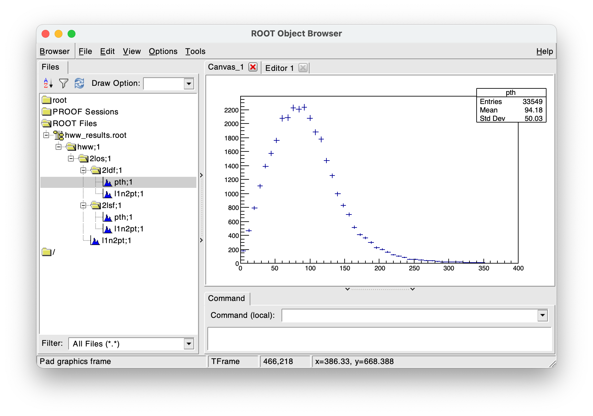

***Ana**lysis **Logic** **A**bstraction **L**ayer*


[](https://github.com/taehyounpark/analogical/actions/workflows/ubuntu.yml)
[](https://github.com/taehyounpark/analogical/actions/workflows/macos.yml)
[](https://opensource.org/licenses/MIT)


## Design goals

- **Coherent interface.** Higher-level languages have intuitive ways to do dataset transformations, e.g. the "DataFrame". The syntax used here aims to achieve the same level of abstraction in a unique way that was originally intended for high-energy physics use cases, referred to as a "DataFlow".
- **Custom implementations.** Users can implement any tabular data: a trivial example is used here, and the a realistic one of CERN ROOT Framework here. Similarly, custom columns and aggregations receive first-class treatment that supports arbitrary inputs, execution, and output.
- **Non-proliferative workflow.** Often times, small changes to an analysis need to be explored. How often has CTRL+C/V been used to copy an entire analysis, made minute changes, and re-process the dataset? With built-in handling of "systematic variations", such changes can be performed and retrieved simultaneously.
- **Computational efficiency.** All operations within the dataset processing is performed at most once per-entry, only when needed. All systematic variations are processed at once. The dataset processing is multi-threaded for thread-safe plugins.

## Examples

The following exercise analyzes simulated physics collision data to reconstruct the Higgs boson transverse momentum in $H\rightarrow WW^{\ast}\rightarrow \ell\nu\ell\nu$ events (public dataset available [here](https://opendata.cern.ch/record/700)).

### Opening the dataset

The multithreading configuration must be specified before opening a dataset.

```cpp
// provide thread count (default: system maximum)
// can also be disabled()'ed
ana::multithread::enable(/* 10 */); 

// Tree is user-implemented
auto df = ana::dataflow<Tree>({"hww.root"}, "mini");
```

### Computing quantities of interest

A `column` holds a value of a specific data type per-entry.

#### Reading columns in the dataset
Existing columns in the dataset can be accessed by supplying their types and names.
```cpp
auto mc_weight = data.read<float>("mcWeight");

auto el_sf = data.read<float>("scaleFactor_ELE");
auto mu_sf = df.read<float>("scaleFactor_MUON");

using VecUI = ROOT::RVec<unsigned int>;
using VecF = ROOT::RVec<float>;
using VecD = ROOT::RVec<float>;

auto lep_pt_MeV = df.read<VecF>("lep_pt");
auto lep_eta = df.read<VecF>("lep_eta");
auto lep_phi = df.read<VecF>("lep_phi");
auto lep_E_MeV = df.read<VecF>("lep_E");
auto lep_Q = df.read<VecF>("lep_charge");
auto lep_type = df.read<VecUI>("lep_type");
auto met_MeV = df.read<float>("met_et");
auto met_phi = df.read<float>("met_phi");
```
#### Simple expressions
Mathematical binary and unary operations available for the underlying data types are supported:
```cpp
// convert the energy scale from MeV to GeV
auto MeV = ana.constant(1000.0);
auto lep_pt = lep_pt_MeV / MeV;

// select leptons whos |eta| < 2.4
auto lep_eta_max = df.constant(2.4);
auto lep_pt_sel = lep_pt[ lep_eta < lep_eta_max && lep_eta > (-lep_eta_max) ];
```
(Shorthand operators, such as `+=`, are not supported).

To access non-trivial methods of the underlying data, any function can be used.
```cpp
using P4 = TLorentzVector;

//  dilepton four-momentum
auto p4ll = df.define([](P4 const& p4, P4 const& q4){return (p4+q4);})(l1p4,l2p4);

// (dilepton+MET) transverse momentum
auto pth = df.define(
  [](const P4& p3, float q, float q_phi){
    TVector2 p2; p2.SetMagPhi(p3.Pt(), p3.Phi());
    TVector2 q2; q2.SetMagPhi(q, q_phi);
    return (p2+q2).Mod();
  })(p4ll, met, met_phi);
```
The computation graph is guaranteed to be
- Recursion-free, as the interface forbids this by construction.
- No-copy of column values passed from one another, unless a conversion is required.

#### Custom definitions
Complex computations can be fully specified by implementing a `definition`. 
```cpp
// define an ith TLorenzVector out of (pt,eta,phi,e) vectors
class NthP4 : public ana::column::definition<P4(VecD, VecD, VecD, VecD)>
{
public:
  NthP4(unsigned int index) : 
    m_index(index)
  {}
  virtual ~NthP4() = default;

  // implement this
  virtual P4 evaluate(ana::observable<VecD> pt, ana::observable<VecD> eta, ana::observable<VecD> phi, ana::observable<VecD> energy) const override {
    P4 p4; p4.SetPtEtaPhiE(pt->at(m_index),eta->at(m_index),phi->at(m_index),energy->at(m_index));
    return p4;
  }

// important: it is up to implementation to ensure thread-safety
protected:
  const unsigned int m_index;
  // int* g_modifiable_global_var;  // <- bad idea
};
```
Combining the above methods:
```cpp
// first- & second-leading lepton four-momenta
auto l1p4 = df.define<NthP4>(0)(lep_pt_sel, lep_eta_sel, lep_phi_sel, lep_E_sel);
auto l2p4 = df.define<NthP4>(1)(lep_pt_sel, lep_eta_sel, lep_phi_sel, lep_E_sel);

// dilepton four-momentum
auto p4ll = l1p4+l2p4;

// dilepton invariant mass
auto mll = df.define([](const P4& p4){return p4.M();})(p4ll);

// dilepton+MET(=higgs) transverse momentum
auto pth = df.define(
  [](const P4& p4, float q, float q_phi) {
    TVector2 p2; p2.SetMagPhi(p4.Pt(), p4.Phi());
    TVector2 q2; q2.SetMagPhi(q, q_phi);
    return (p2+q2).Mod();
  })(p4ll, met, met_phi);
```

#### Column representations

For cases in which values of multiple columns in a dataset correspond to attributes of a parent entity, they can be accommodated by a `representation`.
```cpp
// example: not used in rest of walkthrough

// want to define an object corresponding to "lepton" out of four-momentum, charge, and type columns
class Lepton : public ana::column::representation<Lepton(P4,int,unsigned int)>
{
public:
  // helper to keep track of of properties index
  enum { p4, charge, type };
  
  Lepton() = default;
  virtual ~Lepton() = default;
  
  // can access/derive quantities from properties
  bool getP4()      { return this->value<p4>(); }
  bool getCharge()  { return this->value<charge>(); }
  bool isElectron() { return this->value<type>() == 11; }
  bool isMuon()     { return this->value<type>() == 13; }
}

// ...

auto l1 = df.define<Lepton>()(l1p4, lep_charge[0], lep_type[0]);
```
Representations provide a complementary role to definitions that can improve conceptual clarity (but not necessity) of the computation graph and (in some cases) its efficiency, demonstrated by the following aggregation-example.
```cpp
// using a simple struct to hold properties
struct Lepton { const P4 p4; const double q; const double type; };

// straightforward to use with definition... but optimal?
auto l1 = df.define([](P4 const& p4, int q, unsigned int type){return Lepton{p4,q,type};})(l1p4,lep_charge[0],lep_type[0]);
```
Note that the following computing inefficiencies occur:
- All input column values must be evaluated in order to determine and assign the properties of the `Lepton` instance, even if only a subset of them may end up being used in the end. 
- The `Lepton` must be constructed and destructed for each entry that it is needed for.

##### (Advanced) Direct instance-access of actions

No restrictions are placed on user-implementations of `column` on methods that users may want to add to the class, which can be used to "configure" them prior to the dataset processing. In such cases, access to each instance (one for each thread) can be done synchronously:
```cpp
custom_column.call_all_slots( [](CustomColumn& col){ /* call whatever methods you want to "configure" it, if implemented */ } );
```

Representations possess neither of these shortcomings.
## 2. Applying selections
### 2.1 Cut and weight
Filtering entries in a dataset is done through applying a `selection` associated with a decision based on column values:
- If the decision is a boolean, it is a `cut` that determines whether to ignore the entry all-together.
- If the decision is a float-point value, it is a `weight` that assigns a statistical significance to the entry.

The selection can be applied by providing the column that corresponds to the decision value:
```cpp
using cut = ana::selection::cut;
using weight = ana::selection::weight;

auto n_lep_sel = df.define([](VecF const& lep){return lep.size();})(lep_pt_sel);
auto n_lep_req = df.constant<unsigned int>(2);

auto cut_2l = df.filter<weight>("weight")(mc_weight * el_sf * mu_sf)\
                .filter<cut>("2l")(n_lep_sel == n_lep_req);
// selection decision after the two filter operations:
// cut = (true) && (n_lep_sel == 2)
// weight = (mc_weight * el_sf * mu_sf) * (1.0)
```
Any combination of `cut` or `weight` can be applied in sequence, which compounds them respectively.

### 2.2 (Optional) Branching out & channels
Each selection is associated with an identifier _name_, which need not be unique. Multiple selections can be applied from a single selection to form "branches", but their cuts need not be mutually exclusive.
```cpp
// opposite-sign leptons
auto cut_2los = cut_2l.filter<cut>("2los", [](const VecI& lep_charge){return lep_charge.at(0)+lep_charge.at(1)==0;})(lep_Q);
// different-flavour leptons
auto cut_2ldf = cut_2los.channel<cut>("2ldf", [](const VecUI& lep_type){return lep_type.at(0)+lep_type.at(1)==24;})(lep_type);
// same-flavour leptons
auto cut_2lsf = cut_2los.channel<cut>("2lsf", [](const VecUI& lep_type){return (lep_type.at(0)+lep_type.at(1)==22)||(lep_type.at(0)+lep_type.at(1)==26);})(lep_type);

// same cuts at different branches
auto mll_cut = df.constant(60.0);
auto cut_2ldf_sr = cut_2ldf.filter<cut>("sr")(mll < mll_cut);  // path = "2ldf/sr"
auto cut_2lsf_sr = cut_2lsf.filter<cut>("sr")(mll < mll_cut);  // path = "2lsf/sr"
auto cut_2ldf_wwcr = cut_2ldf.filter<cut>("wwcr")(mll > mll_cut);  // path = "2ldf/cr"
auto cut_2lsf_wwcr = cut_2lsf.filter<cut>("wwcr")(mll > mll_cut);  // path = "2lsf/cr"
```
To preserve uniqueness (should it be desired) of identifiers associated with branched selections, replacing `filter` with `channel` for selection(s) after the fork, such that the _path_ of a selection includes the upstream selection to form a unique string, may be helpful (as done above).

## 3. Counting entries
### 3.1 Booking aggregations and accessing their results
A `aggregation` defines an action that is
- Performed `at()` at a selection, i.e. only if the cut has passed.
    -  Handling (or ignoring) the selection weight.
- Can be `fill()`ed with columns such that their values are also handled.

A full user-implementation must specify what (arbitrary) action is  performed and its output result.
```cpp
// Hist<1,float> is user-implemented.
auto pth_hist = df.book<Hist<1,float>>("pth",100,0,400).fill(pth).at(cut_2los);
// what is doen for each entry, conceptually:
//   if (cut_2los.passed_cut()) { 
//     pth_hist->Fill(pth, cut_2los.get_weight());
//   }
```
Accessing a result of any aggregation triggers the dataset processing:
```cpp
pth_hist.result();  // -> std::unique_ptr<TH1> (specified by Hist<1,float>)
pth_hist->GetEntries();  // shortcut access
```
Each `fill()` and `at()` call returns a new node with those operations applied, such that any aggregation can be:
- Filled with columns any number of times, as long as their dimensionality matches that of the implementation.
- Booked at any (set of) selection(s), as long as the selections booked in each set has unique paths.
```cpp
// fill the histogram with pT of both leptons
auto l1n2_pt_hist = df.book<Hist<1,float>>("l1n2_pt",20,0,100).fill(l1pt).fill(l2pt);

// book it at "2ldf/sr", "2lsf/sr"
auto l1n2_pt_hists_srs = l1n2_pt_hist.at(cut_2ldf_sr, cut_2ldf_wwcr);

// also at "2ldf/wwcr", "2lsf/wwcr"
auto l1n2_pt_hists_wwcrs = l1n2_pt_hist.at(cut_2lsf_sr, cut_2lsf_wwcr);
```
When a aggregation is booked at multiple selections such as the above, result at each selection can be accessed by its path.
```cpp
l1n2_pt_hist_2ldf_sr = l1n2_pt_hists_srs["2ldf/sr"];
l1n2_pt_hist_2ldf_wwcr = l1n2_pt_hists_wwcrs["2ldf/wwcr"];
```
### 3.2 (Optional) "Dumping" results

If a aggregation is booked at numerous selections, it might be convenient to have a consistent way to write out the results across all selections at once. This can be done completely on the user-side or through yet another helper interface class.
```cpp
// booked at multiple selections
auto pth_hists = df.book<Hist<1,float>>("pth",100,0,400).fill(pth).at(cut_2los, cut_2ldf, cut_2lsf);

// want to write histogram at each selection, using its path as sub-folders
auto out_file = TFile::Open("hww_hists.root","recreate");

// Folder is user-implemented
ana::output::dump<Folder>(pth_hists, out_file, "hww");

delete out_file;
```


## Laziness of `lazy` actions

All actions shown above are performed once per entry only if needed:
1. A aggregation will perform its action only if its booked selection has passed its cut.
2. A selection will evaluate its cut decision only if all upstream selections in the chain have passed, and its weight value only if the cut passes.
4. A column value will be evaluated only if it is needed to perform any of the above.

Consider the above example:
1. The computation of ($p_\text{T}^H$ and $m_{\ell\ell}$) accesses (i.e. requires) the first 2 elements of the $\{p_{\text{T}}^{\ell}\}$ vector.
2. The histograms that fill those quantities were booked under a $n_\ell = 2$ selection.
3. The computation is never triggered for entries for which the vector has less than 2 entries.

## 4. Systematic variations

A systematic variation of an analysis constitutes a __change in a column value that affects the outcome of the set of selection and aggregations in an analysis__. Processing these variations within a single computation graph at once offers the following benefits:

- Guarantee that each variation and only the variation is in effect between the nominal and varied results in the rest of the analysis logic.
- Eliminate the runtime overhead associated with repeated processing of the dataset.

### 4.1 Varying a column

Any column can be varied with an alternate definition of the same type, which translates to:
- `reader` can read a different column holding the same data type.
- `constant` can be a different value.
- `equation` can be evaluated with another function of the same signature and return type.
- `definition`/`representation` can be constructed with another set of arguments (instance-access also available per-variation).
 
```cpp
// use a different scale factor (electron vs. pileup...? purely for illustration)
auto el_sf = df.read<float>("scaleFactor_ELE").vary("sf_var","scaleFactor_PILEUP");

// change the energy scale by +/-2%
auto Escale = df.define([](VecD E){return E;}).vary("lp4_up",[](VecD E){return E*1.02;}).vary("lp4_dn",[](VecD E){return E*0.98;});
auto lep_pt_sel = Escale(lep_pt)[ lep_eta < lep_eta_max && lep_eta > (-lep_eta_max) ];
auto lep_E_sel = Escale(lep_E)[ lep_eta < lep_eta_max && lep_eta > (-lep_eta_max) ];
```
This results in a `varied` action, which now contains multiple variations of the `lazy` action.

### 4.2 Propagation of variations through selections and aggregations

The analysis interface works the same way, whether an action is `lazy` or `varied`, meaning:
- Any column evaluated from varied input columns containing will be varied correspondingly.
- Any selections and aggregations performed with varied columns will be varied correspondingly.

The propagation of variations across multiple actions occur "in lockstep" and "transparently", meaning:
- If two actions each have a variation of the same name, they are in effect together.
- If one action has a variation while another doesn't, then the nominal is in effect for the latter.

```cpp
auto l1p4 = df.define<NthP4>(0)(lep_pt, lep_eta, lep_phi, lep_E);
auto l2p4 = df.define<NthP4>(1)(lep_pt, lep_eta, lep_phi, lep_E);
l1p4.has_variation("lp4_up");  // true
l1p4.has_variation("sf_var");  // false

// ...

auto cut_2l = df.filter<weight>("weight")(mc_weight * el_sf * mu_sf)\
                 .filter<cut>("2l")(n_lep_sel == n_lep_req);
cut_2l.has_variation("lp4_up");  // true
cut_2l.has_variation("sf_var");  // true

// ...

auto mll_vars = df.book<Hist<1,float>>("mll",50,0,100).fill(mll).at(cut_2los);
mll_vars.has_variation("lp4_up"); // true : mll & cut_2los varied
mll_vars.has_variation("sf_var"); // true : mll nominal & cut_2los varied
```
Each variation can be accessed by its name:
```cpp
mll_vars.nominal()->Draw();
mll_vars["lp4_up"]->Draw("same");
```


Keeping track of multiple systematic variations *and* selections is also possible:
```cpp
// mll contains variations = {lp4_up, sf_var}
// booked at selections = {cut_2ldf, cut_2lsf}
auto mll_channels_vars = df.book<Hist<1,float>>("mll",50,0,200).fill(mll).at(cut_2ldf, cut_2lsf);

// specify variation name, followed by selection path
mll_channels_vars.nominal()["2ldf"]->GetEntries();
mll_channels_vars["lp4_up"]["2lsf"]->GetEntries();
```

## Installation

C++17 support is required (tested with Clang 14.0.0 and GCC 9.3.0).

### [Single-header](https://raw.githubusercontent.com/taehyounpark/analogical/master/analogical.h)
```cpp
#include "analogical.h"
```
### CMake
```sh
git clone https://github.com/taehyounpark/analogical.git
``````
#### External
```sh
cd analogical/ && mkdir build/ && cd build/
cmake ../
cmake --build .
cmake --install .
```
```CMake
find_package(analogical 0.1.0 REQUIRED)
...
add_library(Analysis ...)
...
target_link_libraries(Analysis INTERFACE ana::analogical)
```
```cpp
#include "ana/analogical.h"
```
#### Integrated
```CMake
add_subdirectory(analogical)
...
add_library(Analysis ...)
...
target_link_libraries(Analysis INTERFACE ana::analogical)
```
