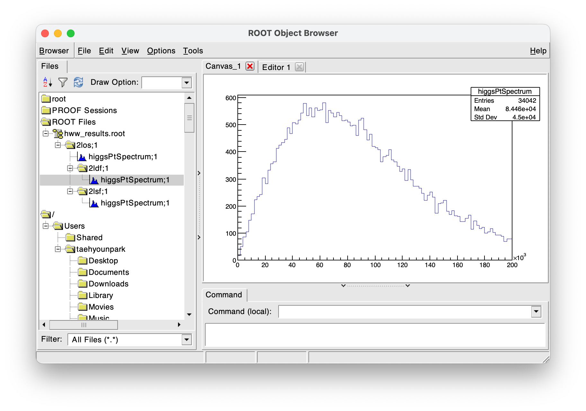

A coherent interface for columnar data analysis in C++.
- Implicit parallel processing of datasets.
- Fast and intuitive computation of column values.
- Systematic application of selections and/or statistical weights to entries.
- Customizable output of analysis results.

## Prerequisites
- C++17 standard compiler
- CMake 3.12 or newer

## Quickstart

The following example uses the [RAnalysis](https://github.com/taehyounpark/RAnalysis) implementation for the [CERN ROOT library](https://root.cern/) in order to showcase a conceptual example of a physics collision data analysis performed to reconstruct the Higgs boson transverse momentum in a simulated dataset of the $H\rightarrow WW^{\ast}\rightarrow e\nu\mu\nu$ decay.

### 0. Opening the dataset

Support for any dataset format that can be represented as a (per-row) $\times$ (column-value) structure is available.
```
ana::multithread::enable();
auto data = ana::analysis<Tree>();
data.open("hww.root");
```
- The reading and partitioning of the input dataset for parallel processing, as implemented by `Tree` here, is done by the user (see `ana::input::dataset<CRTP>`).

### 1. Accessing columns of interest
Information in dataset organized by *columns* can be accessed by supplying their data types and names:
```
auto mcWeight = data.read<float>("mcWeight");
auto nlep = data.read<unsigned int>("lep_n");
auto lepPts = data.read<ROOT::RVec<float>>("lep_pt");
auto lepEtas = data.read<ROOT::RVec<float>>("lep_eta");
auto lepPhis = data.read<ROOT::RVec<float>>("lep_phi");
auto lepEs = data.read<ROOT::RVec<float>>("lep_E");
auto lepCharges = data.read<ROOT::RVec<float>>("lep_charge");
auto lepTypes = data.read<ROOT::RVec<unsigned int>>("lep_type");
auto met = data.read<float>("met_et");
auto metPhi = data.read<float>("met_phi");
```
- The column data type can be arbitrarily nested and/or complicated, e.g. `ROOT::RVec<float>`, as long as it is defined how to do so (see `ana::input::reader<CRTP>`).

Computing new columns from existing ones can be explicitly specified (great for configurability):
```
auto leadLepP4 = data.define<NthFourMomentum>("leadLepP4", 0);  // leading = 0th index
leadLepP4.evaluate(lepPts, lepEtas, lepPhis, lepEs);
auto subleadLepP4 = data.define<NthFourMomentum>("subleadLepP4", 1);  // subleading = 1st index
subleadLepP4.evaluate(lepPts, lepEtas, lepPhis, lepEs);
```
- `NthFourMomentum` implements `ana::column::definition<Ret(Args...)>`.

Or, it can be as minimal as the expressions themselves:
```
auto dilepP4 = data.evaluate("dilepP4", [](const TLorentzVector& p4, const TLorentzVector& q4){return (p4+q4);}, leadLepP4,subleadLepP4 );
auto higgsPt = data.evaluate("higgsPt",
  [](const TLorentzVector& dilep_p4, float met, float met_phi) {
    TVector2 ptll; ptll.SetMagPhi(dilep_p4.Pt(), dilep_p4.Phi());
    TVector2 met2d; met2d.SetMagPhi(met, met_phi);
    return (ptll+met2d).Mod();
  },
  dilepP4, met, metPhi
);
```


### 2. Applying selections
Filtering a dataset is done via a *selection*, which refers to either:
- A boolean decision to consider the event if passed, ignore otherwise (see `ana::selection::cut`), or
- A floating-point value that represents the statistical significance of the entry (see `ana::selection::weight`).
A *channel* is a special flag to nest all subsequent selections paths.
```
data.filter<ana::selection::weight>("mcEventWeight", mcWeight);
auto cut2l = data.filter<ana::selection::cut>("2l", [](const int& nlep){return (nlep == 2);}, nlep);
auto cut2los = data.channel<ana::selection::cut>("2los", [](const ROOT::RVec<float>& lep_charge){return (lep_charge.at(0) + lep_charge.at(1) == 0);}, lepCharges);
auto cut2ldf = cut2los.filter<ana::selection::cut>("2ldf", [](const ROOT::RVec<int>& lep_type){return (lep_type.at(0) + lep_type.at(1) == 24);}, lepTypes);
auto cut2lsf = cut2los.filter<ana::selection::cut>("2lsf", [](const ROOT::RVec<int>& lep_type){return ((lep_type.at(0) + lep_type.at(1) == 22) || (lep_type.at(0) + lep_type.at(1) == 26));}, lepTypes);
```

### 3. Counting the results
A "counter" represents an action to be performed once per-entry, based on:
- Perform the action if its "booked" selection passes the cut, with the given statistical weight.
- (Optional) values of other columns with which the counter is "filled".
```
  auto higgsPtSpectrum = data.count<Histogram<1,float>>("higgsPtSpectrum", 100,0,2e6);
  higgsPtSpectrum.fill(higgsPt);
  higgsPtSpectrum.book(cut2los, cut2ldf, cut2lsf);
```

The result of each counter, in this case a `shared_ptr<TH1>`, can be accessed by re-specifying the path of the booked selection:
```
  auto higgsPtSpectrumAt2los = higgsPtSpectrum["2los"].result();
  auto higgsPtSpectrumAt2ldf = higgsPtSpectrum["2los/2ldf"].result();
```
- `Histogram<1,float>` implements `ana::counter::logic<std::shared_ptr<Out(Fills...)>)`.
- Since `"2los"` selection was marked as a channel, the later selection paths are nested as `"2los/2LOF"`, `"2los/2ldf"`, etc.

Alternatively, all the results booked across multiple selections can be organized and dumped into as desired. 
```
  auto outputFile = TFile::Open("hww_results.root")
  ana::output::dump<Folder>(higgsPtSpectrum,outputFile);
```
- `Folder` implements `ana::counter::reporter<CRTP>` 



## Benchmarks

The performance metrics of a minimal data analysis workflow involving:
- Input CSV file: [CERN Open Data Portal](https://opendata.cern.ch/record/700)
- One custom column computation
- One filter operation
- One counter result output

On the MacBook Pro (16-inch, 2019) with the following specifications:
- 2.3 GHz 8-Core Intel Core i9
- 32 GB 2667 MHz DDR4

Results:

| | CPU | RAM |
| --- | ---: | ---: |
| ana | 279.398 ms | MB |
| pandas | ms | MB |