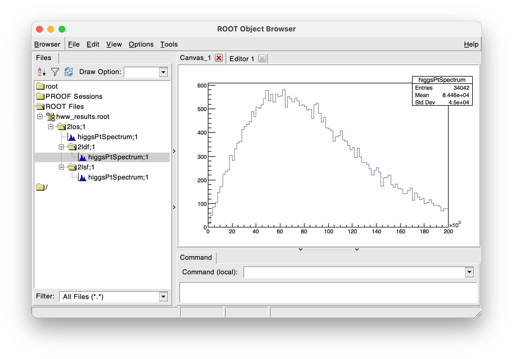
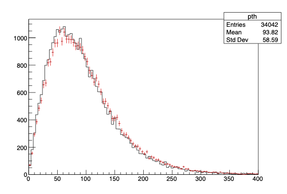

Coherent data analysis in C++.

## Features
- Multithreaded processing of the dataset.
- Declarative computation of column values.
- Clear chain and/or branches of selections applied to entries.
- Propagation of systematic variations through an analysis.
- Customizable logic & output of analysis results.

## Key concepts

A clear way to define the logic data analysis procedures is crucial not only for the technical robustness of the results, but also to enable a way for analyzers to consistently extend and investigate complicated dataset transformation procedures as a project develops.
This library provide an ***_abstract_*** interface for users to achieve these features.

- An `analysis` entity that represents the entire dataset.
- Performing an operation outputs a `delayed` node representing the booked action.
  - The processing of the dataset performing booked actions are triggered upon accessing the result of a node.
- Further operations can be done in the context of existing ones, which are provided as input arguments.
  - By construction, the computation graph is prevented from forming recursions.
- A node can be systematically `varied` for which an alternate definition of the action is included in the analysis.
  - All other operations that involve varied nodes carry them through, such that the end results represent the full union of all applicable variations.
  - The propagation is "transparent", meaning no changes to the rest of interface calls are needed to see the variations in effect.

Some of these paradigms are already standard tools in other programming languages such as Python (e.g. `dask.delayed`), while others (e.g. `varied<T>`) is not as much so.

## Prerequisites
- C++17 standard compiler (tested with Clang 14 and GCC 11)
- CMake 3.24 or newer

## Applied walkthrough

The following example uses an implementation of the interface for the [CERN ROOT framework](https://root.cern/) to illustrate a conceptual demonstration of physics collision data analysis reconstructing the Higgs boson transverse momentum in a simulated $H\rightarrow WW^{\ast}\rightarrow e\nu\mu\nu$ dataset. See [here](https://github.com/taehyounpark/RAnalysis) for the implementation and [CERN Open Data Portal](https://opendata.cern.ch/record/700) for the dataset.

### 0. Opening the dataset
Any data structure that can be represented as a (per-row) $\times$ (column-value) layout is supported. The initialization of an *analysis* proceeds as:
```cpp
// provide or default to maximum number of thread count
ana::multithread::enable();  

// implements ana::input::dataset<CRTP>
auto data = ana::analysis<TreeData>();

// constructor arguments of TreeData
data.open("mini", {"hww_mc.root"});  
```

### 1. Accessing quantities of interest
#### 1.1 Reading columns in the dataset
Existing *columns* in the dataset can be accessed by supplying their types and names.
```cpp
// implements ana::input::dataset<CRTP>, ana::column::reader<T>
auto mc_weight = data.read<float>("mcWeight");
auto el_sf = data.read<float>("scaleFactor_ELE");
auto mu_sf = data.read<float>("scaleFactor_MUON");
auto n_lep = data.read<unsigned int>("lep_n");
auto lep_pt_MeV = data.read<ROOT::RVec<float>>("lep_pt");
auto lep_eta = data.read<ROOT::RVec<float>>("lep_eta");
auto lep_phi = data.read<ROOT::RVec<float>>("lep_phi");
auto lep_E_MeV = data.read<ROOT::RVec<float>>("lep_E");
auto lep_Qs = data.read<ROOT::RVec<float>>("lep_charge");
auto lep_types = data.read<ROOT::RVec<unsigned int>>("lep_type");
auto met_MeV = data.read<float>("met_et");
auto met_phi = data.read<float>("met_phi");
```
#### 1.2 Computing new quantities
Mathematical binary and unary operations supported by the underlying data types are passed through:
```cpp
auto GeV = ana.constant<double>(1000.0);
auto lep_pt = lep_pt_MeV / GeV;  // ROOT::RVec<float> / double
auto lep_E = lep_Et_MeV / GeV;
auto met = met_MeV / GeV;
```
Custom lambda expressions can also be used:
```cpp
// see below for l1p4 and l2p4 definitions
auto dilepP4 = data.define([](TLorentzVector const& p4, TLorentzVector const& q4){return (p4+q4);})(l1p4,l2p4);
                       // * first argument is the functor,                                         * second the input columns.
```
For more complicated definitions, they can be explicitly specified by a full class implementation:
```cpp
using RVecD = ROOT::RVec<double>;
class ScaledP4 : public ana::column::definition<TLorentzVector(RVecD, RVecD, RVecD, RVecD)>
{
public:
  ScaledP4(unsigned int index, double scale=1.0) : 
    ana::column::definition<TLorentzVector(RVecD, RVecD, RVecD, RVecD)>(),
    m_index(index)
  {}
  virtual ~ScaledP4() = default;
  virtual TLorentzVector evaluate(ana::observable<RVecD> pt, ana::observable<RVecD> eta, ana::observable<RVecD> phi, ana::observable<RVecD> es) const override {
    TLorentzVector p4;
    p4.SetPtEtaPhiE(pt->at(m_index),eta->at(m_index),phi->at(m_index),es->at(m_index));
    return p4*m_scale;
  }
protected:
  unsigned int m_index;
  double m_scale;
};

// ...

auto l1p4 = data.define<ScaledP4>(0)(lep_pt, lep_eta, lep_phi, lep_E);
                              // * first set of arguments is now the class constructor.
```

### 2. Applying selections
#### 2.1 Cut versus weight
Filtering entries in a dataset is done via a *selection*, which is either a boolean decision for floating-point value that chooses to ignore or assigns a non-uniform statistical significance for each entry, respectively.
```cpp
using cut = ana::selection::cut;
using weight = ana::selection::weight;
auto n_lep_req = data.constant<int>(2)
auto cut2l = data.filter<weight>("weight")(mc_weight * el_sf * mu_sf)\
                 .filter<cut>("2l")(n_lep == n_lep_req);
                 // reminder: delayed math operations
```
- Selections that are applied in sequence after the first can be chained from the nodes directly.
- Each filter operation requires an identifiable name, which is used to form the path of the full chain of selections applied.
#### 2.2 Branching out & channels
Distinct (not required to be mutually exclusive) chains of selections can branch out from a common point. Designating a particular selection as a *channel* marks that its name will be reflected as part of the path of downstream selections.
```cpp
// requiring the two leptons have opposite charges
            // * further selections must be applied from the node
                  // * note "channel" designation
auto cut2los = cut2l.channel<cut>("2los", [](ROOT::RVec<float> const& qs){return (qs.at(0) + qs.at(1) == 0);})(lep_charges);
                                       // * custom expressions same as in for column definition possible

// branching out from a common 2-lepton, opposite-sign cut
  // * different-flavour leptons
auto cut2ldf = cut2los.filter<cut>("2ldf", [](ROOT::RVec<int> const& flavours){return (flavours.at(0) + flavours.at(1) == 24);})(lep_types);
  // * same-flavour leptons
auto cut2lsf = cut2los.filter<cut>("2lsf", [](ROOT::RVec<int> const& flavours){return ((flavours.at(0) + flavours.at(1) == 22) || (lep_type.at(0) + lep_type.at(1) == 26));})(lep_types);
```

### 3. Counting entries
#### 3.1 Booking counters
A *counter* is an arbitrary action performed once per-entry:
- Only if a specified selection passes the cut, "count" the entry with its weight.
- (Optional) receive the values of other columns to be "filled" with. This operation can be performed an arbitrary number of times on a counter.
```cpp
// Histogram<1,float> : ana::counter::logic<std::shared_ptr<TH1F>(float)>
                                           // * constructor arguments
auto pth_2los = data.book<Histogram<1,float>>("pth",100,0,400)\
                  // * pth_hist->Fill(pth, cut2los.get_weight());
                    .fill(pth)\
                  // * if (cut2los.passed_cut()) { ... }
                    .at(cut2los);

auto l1n2_pt_hists = data.book<Histogram<1,float>>("l1n2_pt",20,0,100)\
                         // * any number of fills can be done
                           .fill(l1pt).fill(l2pt)\
                         // * can be booked at selections at once
                           .at(cut2ldf, cut2lsf);
```
The number of computational operations performed in order to perform this final step is guaranteed to be the minimum required, and any unnecessary nodes that are not performed.
- In the above example, note that the counters were all booked after $n_\ell = 2$ selection.
- Therefore, the calculation of the dilepton-requiring quantities will not occur unless the event satisfies.

#### 3.2 Processing the dataset and accessing results
The result of each counter can be accessed by specifying the path of the booked selections
```cpp
      // * trigger dataset processing
pth_2los.result();  // -> std::shared_ptr<TH1>

                              // * also accessible by selection path key
auto l1n2_pt_2lsf = l1n2_pt_hists["2los/2ldf"].result();
auto l1n2_pt_2ldf = l1n2_pt_hists["2los/2lsf"].result();

auto out_file = TFile::Open("hww_hists.root","create");
// helper function to "dump" counter results at all selections
ana::output::dump<Folder>(l1n2_pt_hists, out_file);
               // * Folder : ana::counter::summary<Folder>
               // * i.e. user-implementable
delete out_file;
```


### 4. Systematic variations

#### 4.1 Varying a column/selection
*Any* column node can be varied with an alternative definition of itself. Once these variations exist, they can be ensured to transparently propagate to future nodes, such that the final set of applied variations of any action is the union of individual sets of variations from participating nodes.
- For dataset columns and/or ones that do not require input columns (i.e. constants), they can be varied simply by calling their new definition:
```cpp
// dataset columns and constants of identical types can be defined
auto lep_pt = data.read<ROOT::RVec<float>>("lep_pt").vary("lpt_cone30", "lep_ptcone30");

// rest of the interface remains unchanged
// but now, "lpt_cone30" is applied from lep_pt variation
auto l1p4 = data.define<ScaledP4>(0)(lep_pt, lep_eta, lep_phi, lep_E);
```
- For computed columns, their varied definition must precede their input arguments.
```cpp
// adding a variation before any existing ones propagate through
auto l1p4 = data.define<ScaledP4>(0).vary("lp4_up",0,1.02)\
              (lep_pt, lep_eta, lep_phi, lep_E);
// union set of variations in effect: {lpt_cone30, lp4_up}

// variations in multiple columns with the same name are synchronized
auto l2p4 = data.define<ScaledP4>(1).vary("lp4_up",1,1.01)\
              (lep_pt, lep_eta, lep_phi, lep_E);
```
The propagation continues through to filters and counters, such that the final output results can be access by their names:
```cpp
// again, interface remains unchanged
auto pth_2ldf_vars = data.book<Histogram<1,float>>("pth",100,0,200).fill(pth).at(cut2ldf);

// note: additional nominal() & variation access
auto pth_2ldf_nom = pth_2ldf_vars.nominal().result();
auto pth_2ldf_lp4_up = pth_2ldf_vars["lep_p4_up"].result();
```
By running multiple variations of the analysis computation in this way for each entry at a time, the performance cost associated with repeated dataset readout can be avoided.
