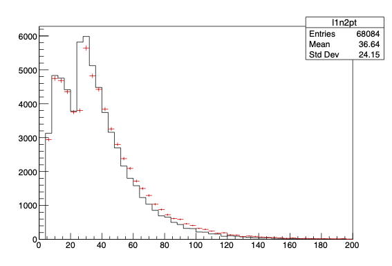

Coherent data analysis in C++.

## Features
- Multithreaded processing of the dataset.
- Declarative computation of column values.
- Clear chain and/or branches of selections applied to entries.
- Propagation of systematic variations through an analysis.
- Customizable logic & output of analysis results.

## Lightning summary

A clear way to define the logic of the data analysis procedures is crucial not only for the technical robustness of the results, but also for analyzers to be able to consistently extend existing ones as a project develops.
This library provide an _abstract_ interface for users to achieve this.

- An `analysis` entity represents the dataset to be processed.
- An operation returns a `delayed` node representing the booked action, which is lazily-executed if and only when its result can be triggered.
  - Further operations can be done in the context of existing ones as its input arguments.
- A node can be systematically `varied` for which an alternate definition of the action is included in the analysis.
  - They are transparently propagated through any other nodes that the varied node(s) participate it.

## Prerequisites
- C++17 standard compiler (tested with Clang 14 and GCC 11)
- CMake 3.24 or newer

## Walkthrough

The following example uses an implementation of the interface for the [CERN ROOT framework](https://root.cern/) to illustrate a conceptual demonstration of physics collision data analysis reconstructing the Higgs boson transverse momentum in a simulated $H\rightarrow WW^{\ast}\rightarrow e\nu\mu\nu$ dataset. See [here](https://github.com/taehyounpark/RAnalysis) for the implementation and example code and [here](https://opendata.cern.ch/record/700) for the publicly-available dataset.

### 0. Opening the dataset
Any data structure that can be represented as a (per-row) $\times$ (column-value) layout is supported. The initialization of an *analysis* proceeds as:
```cpp
// provide or default to maximum number of thread count
ana::multithread::enable();  

// TreeData : ana::input::dataset<TreeData> (i.e. user-implemented)
auto data = ana::analysis<TreeData>();

// constructor arguments of TreeData
data.open("mini", {"hww_mc.root"});  
```

### 1. Accessing quantities of interest
#### 1.1 Reading columns in the dataset
Existing *columns* in the dataset can be accessed by supplying their types and names.
```cpp
// TreeData::Branch<float> : ana::input::dataset<CRTP>, ana::column::reader<T>  (i.e. user-implementable)
auto mc_weight = data.read<float>("mcWeight");
auto el_sf = data.read<float>("scaleFactor_ELE");
auto mu_sf = data.read<float>("scaleFactor_MUON");

// - arbitrary data types can be implemented
auto lep_pt_MeV = data.read<ROOT::RVec<float>>("lep_pt");
auto lep_eta = data.read<ROOT::RVec<float>>("lep_eta");

// etc. etc.
```
#### 1.2 Computing new quantities
Mathematical binary and unary operations supported by the underlying data types are passed through:
```cpp
// - ROOT::RVec<float> support division by double
auto GeV = ana.constant(1000.0);
auto lep_pt = lep_pt_MeV / GeV;
// etc. for all other magnitudes

// - operations need not be atomic, commposite ones are okay
auto lep_eta_max = hww.constant(2.4);
auto lep_pt_sel = lep_pt[ lep_eta < lep_eta_max && lep_eta > (-lep_eta_max) ];
// etc. for all other lep_X
```
Custom lambda expressions can also be used:
```cpp
// (see below for l1p4 and l2p4 definitions)
auto dilepP4 = data.define([](TLV const& p4, TLV const& q4) {return (p4+q4);})(l1p4,l2p4);
// - first argument is the functor
// - second set are the input columns
```
For more complicated definitions, they can be explicitly specified by a full class implementation:
```cpp
using TLV = TLorentzVecto;
using RVecD = ROOT::RVec<double>;
class ScaledP4 : public ana::column::definition<TLV(RVecD, RVecD, RVecD, RVecD)>
// - define an ith TLorenzVector out of (pt,eta,phi,e) vectors
{
public:
  ScaledP4(unsigned int index, double scale=1.0) : 
    ana::column::definition<TLV(RVecD, RVecD, RVecD, RVecD)>(),
    m_index(index)
  {}
  virtual ~ScaledP4() = default;

  // implement this
  virtual TLV evaluate(ana::observable<RVecD> pt, ana::observable<RVecD> eta, ana::observable<RVecD> phi, ana::observable<RVecD> es) const override {
    TLV p4;
    p4.SetPtEtaPhiE(pt->at(m_index),eta->at(m_index),phi->at(m_index),es->at(m_index));
    return p4*m_scale;
  }
  // - note that input columns are originally RVecF
  // - ana::observable<T> used to access to any convertible/inherited types

protected:
  unsigned int m_index;
  double m_scale;
  // - it is up to implementation to ensure thread-safety
  // int* g_modifiable_global_var;  // <- bad idea
};

// ...

auto l1p4 = hww.define<ScaledP4>(0)(lep_pt_sel, lep_eta_sel, lep_phi_sel, lep_E_sel);
// - first set of arguments is now the class constructor
// - second set remains the input columns
```
The computation graph formed can be ensured to be
- Recursion-free: the grammar forbids this by construction.
- Non-redundant: the value of a column is computed at most once per entry.
- No-copy: values are passed by `const T&` from one column to another (unless a conversion is required).

### 2. Applying selections
#### 2.1 Cut versus weight
Filtering entries in a dataset is done via a *selection*, which is either a boolean decision for floating-point value that chooses to ignore or assign statistical significance to an entry, respectively.
```cpp
using cut = ana::selection::cut;
using weight = ana::selection::weight;

auto n_lep_sel = hww.define([](ROOT::RVec<float> const& lep){return lep.size();})(lep_pt_sel);
auto n_lep_req = data.constant<int>(2);
auto cut2l = data.filter<weight>("weight")(mc_weight * el_sf * mu_sf)\
                 .filter<cut>("2l")(n_lep_sel == n_lep_req);
                 // final cut = (true) && (n_lep == n_lep_req)
                 // final weight = (mc_weight * el_sf * mu_sf) * (1.0)
```
Selections that are applied in sequence after the first can be chained from the nodes directly. Note that each selection is associated with an identifier name, which is used to define the "path" of the selection chain applied. However, these names need not be unique (see below).
#### 2.2 Branching out & channels
Different chains of selections can branch out from a common point. Furthermore, designating a particular selection as a *channel* marks its name to be included as part of the path of downstream selections.
```cpp
// requiring the two leptons have opposite charges
auto cut2los = cut2l.channel<cut>("2los", [](ROOT::RVec<float> const& qs){return (qs.at(0) + qs.at(1) == 0);})(lep_charges);
// - sequential selections must be applied from the node
// - note "channel" designation, current path = "2los"

// branching out from a common 2-lepton, opposite-sign cut
// - different-flavour leptons, path = "2los/2ldf"
auto cut2ldf = cut2los.filter<cut>("2ldf", [](ROOT::RVec<int> const& flavours){return (flavours.at(0) + flavours.at(1) == 24);})(lep_types);
// - same-flavour leptons, path = "2los/2ldf"
auto cut2lsf = cut2los.filter<cut>("2lsf", [](ROOT::RVec<int> const& flavours){return ((flavours.at(0) + flavours.at(1) == 22) || (lep_type.at(0) + lep_type.at(1) == 26));})(lep_types);
```

This approach can accomodate any selection structure, but is specifically chosen to be intuitive for common HEP analysis workflows:
- Cuts of separate chains need not be mutually exclusive.
- Any ambiguities in the named paths of selections applied, e.g. two selections with the same name past a fork, can be resolved by judicious channel designation of their upstream selections.

As was the case for column definitions, the decisions (cut or weight) of a selection is never redundantly computed for an entry if an upstream selection is already known to have failed.

### 3. Counting entries
#### 3.1 Booking counters
A *counter* is an arbitrary action performed for each entry:
- Perform the action only if its booked selection passed the cut, with knowledge of its weight.
- (Optional) receive the values from input columns to be "filled" with.
```cpp
// Histogram<1,float> : ana::counter::logic<std::shared_ptr<TH1F>(float)> (i.e. user-immplementable)
auto pth_2los = data.book<Histogram<1,float>>("pth",100,0,400)\
                    .fill(pth)\
                    .at(cut2los);
                  // if (cut2los.passed_cut()) { 
                  //   pth_hist->Fill(pth, cut2los.get_weight());
                  // }

// bonus: "recycle" a definition for different input columns
auto get_pt = hww.define([](TLV const& p4){return p4.Pt();});
auto l1pt = get_pt(l1p4);
auto l2pt = get_pt(l2p4);

// this time, fill twice and make the histogram for two selection points
auto l1n2_pt_hists = data.book<Histogram<1,float>>("l1n2_pt",20,0,100)\
                           .fill(l1pt).fill(l2pt)\
                           .at(cut2los, cut2ldf, cut2lsf);
                           // - any number of fills can be done
                           // - any number of selecionts can be booked
```
In the above example (but similarly for all counters in general), the following items are noteworthy as a corollary of the column and selection computation non-redundancy:
- The filled columns ($p_\text{T}^H$ and $p_\text{T}^{\ell_2}$) assume at least 2 elements in the input lepton vectors.
- The counters, however, do require a $n_\ell = 2$ selection.
- Therefore, the computation of dilepton quantities will never be performed for entries that would haven otherwise thrown an exception.

In summary, the counting operation is exactly as safe as what the user specifies it to be.

#### 3.2 Processing the dataset and accessing results
The result of each counter can be accessed by specifying the path of the booked selections
```cpp
// trigger dataset processing
pth_2los_res.result();  // -> std::shared_ptr<TH1>

                              // - also accessible by selection path key
auto l1n2_pt_2lsf = l1n2_pt_hists["2los/2ldf"].result();
auto l1n2_pt_2ldf = l1n2_pt_hists["2los/2lsf"].result();

// helper function to "dump" counter results at all selections
// Folder : ana::counter::summary<Folder> (i.e. user-implementable)
auto out_file = TFile::Open("hww_hists.root","recreate");
ana::output::dump<Folder>(pth_2los_res, out_file);
ana::output::dump<Folder>(l1n2_pt_hists, out_file);
delete out_file;
```


### 4. Systematic variations

#### 4.1 Varying a column
A systematic variation is defined to be a different outcome of the analysis results under some alternative definition of select columns.
- A column node can be varied by an alternative instance of the same type.
- Any column definitions whose input columns are affected by variations will also be varied.

By running variations of the analysis computation for each entry at once, the performance overhead associated with repeated dataset processing is avoided.
```cpp
// read an different column as the used quantity
auto lep_pt = data.read<ROOT::RVec<float>>("lep_pt").vary("lpt_cone30", "lep_ptcone30");

// or, vary how a column definition runs
auto l1p4 = data.define<ScaledP4>(0)\
                .vary("lp4_up",0,1.02)\
                (lep_pt, lep_eta, lep_phi, lep_E);
// - any variations *must* be added before providing input columns

// union set of variations in effect:
// - "lpt_cone30" from lep_pt
// - "lp4_up" from itself
l1p4.has_variation("lpt_cone30");  // true
l1p4.has_variation("lp4_up");  // true

// variations in multiple columns with the same name will be applied together
auto l2p4 = data.define<ScaledP4>(1).vary("lp4_up",1,1.01)(lep_pt, lep_eta, lep_phi, lep_E);
```
#### 4.2 Propagation of variations through selections and counters
No further treatment and/or changes to other analysis calls are required. These variations are ensured to be propagated through downstream selections and counters.
```cpp
// nothing to change about the filter() method!
auto cut2l = data.filter<weight>("weight")(mc_weight * el_sf * mu_sf)\
                 .filter<cut>("2l")(n_lep_sel == n_lep_req);

// ...

// nothing to change about the book() method!
auto pth_2ldf_vars = data.book<Histogram<1,float>>("pth",100,0,200).fill(pth).at(cut2ldf);

// ...

// additional nominal() & variation access
auto pth_2ldf_nom = pth_2ldf_vars.nominal().result();
auto pth_2ldf_lp4_up = pth_2ldf_vars["lep_p4_up"].result();
```
