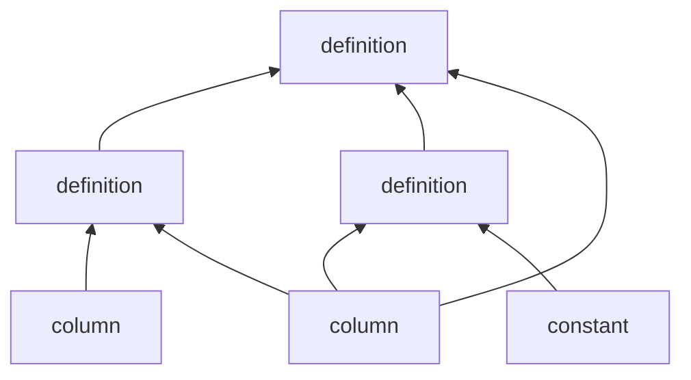

Computing quantities of interest out of existing column values in an entry can become a complicated task.

The following properties of the computation graph are guaranteed by the library:

- No circular loops in computation.
- No values are copied when used as inputs for definitions.
    - The value *is* copied if an implicit conversion is required.
- A value is computed once per-entry, only if needed.