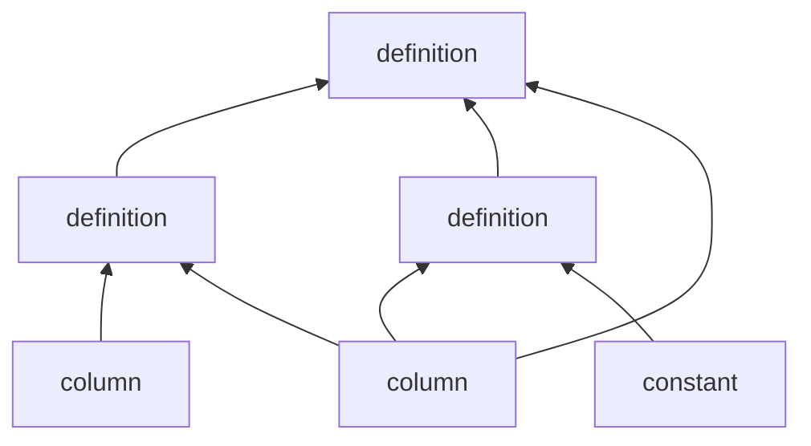

A `column` starts out independent when it is read-in from an input dataset, 
but user-defined column must be evaluated out existing ones, i.e. are dependent.
So the computation graph forms a tower of input and output columns such as

where the graph traversal for each entry is top-down in accordance with the columns' laziness:
only if and when the value of a dependent column needs to be computed are its input columns computed.

The following properties of the computation graph are further guaranteed:

- No circular loops in computation.
- No values are copied when used as inputs for dependent columns.
    - The value *is* copied if an implicit conversion is required.
- The value is never computed more than once per entry.