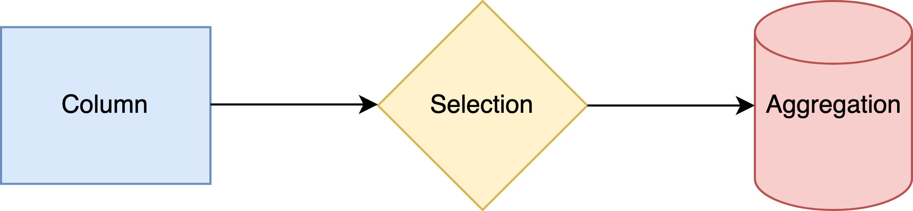

A data query consists of a directed, acyclic graph of actions performed for each entry, called a `dataflow`.

An action falls into one of three types associated with a set of applicable tasks to be performed,
and each type contains its own sub-graph of tasks, which is rolled into one in the dataflow:

| Action | Description | Methods | Description | Task Graph | Input actions |
| :--- | :-- | :-- | :-- | :-- | :-- | 
| `column` | Quantity of interest | `read()` | Read a column. | Computation graph | -- |
| | | `define()` | Evaluate a column. | | |
| `selection` | Boolean decision | `filter()` | Apply a cut. | Cutflow | `column` |
| | Floating-point decision | `weight()` | Apply a statistical significance. | | |
| `query` | Perform a query | `make()` | Make a query plan. | Experiment | `column` & `selection` |
| | | `fill()` | Populate with column value(s). | | |
| | | `book()` | Perform over selected entries. | | |