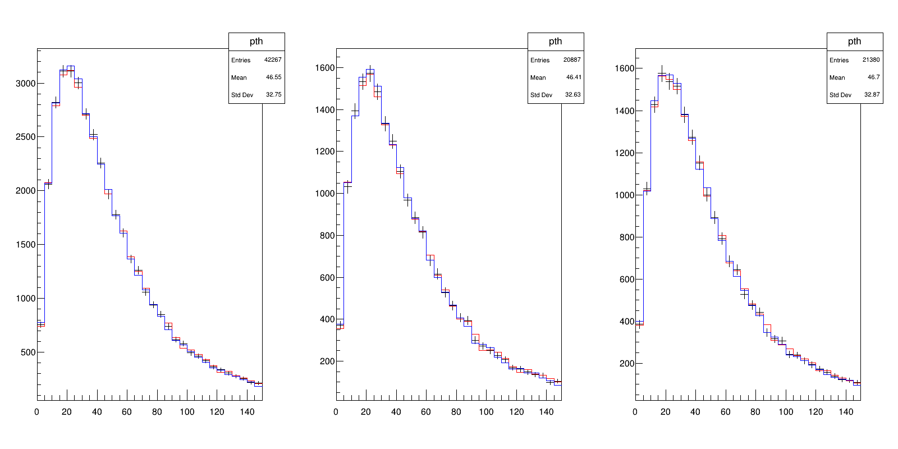

# `TTree` analysis with systematic variations

- Simulated $gg \to H \to WW* \to \ell\nu\ell\nu$ events: [ATLAS open data](https://opendata.cern.ch/record/3825).

1. Apply the MC event weight.
2. Select entries for which there are exactly two opposite-sign leptons in the event.
3. Separate into different/same-flavour channels for electrons and muons.
4. Require $m_{\ell\ell} > 10(12)\,\mathrm{GeV}$ for different(same)-flavour channel.
5. Merge channels to form flavour-inclusive opposite-sign region post-$m_{\ell\ell}$ cut.
6. In each region, plot the distribution of $p_{\mathrm{T}}^H = \left| \mathbf{p}_{\mathrm{T}}^{\ell\ell} + \mathbf{p}_{\mathrm{T}}^{\mathrm{miss}} \right|$.
	- Scale electron(muon) energy scale by $\pm 1(2)\,\%$ as systematic variations.

```cpp
#include "AnaQuery/Hist.h"
#include "AnaQuery/Tree.h"

#include "queryosity.h"

namespace qty = queryosity;
using dataflow = qty::dataflow;
namespace multithread = qty::multithread;
namespace dataset = qty::dataset;
namespace column = qty::column;
namespace query = qty::query;
namespace systematic = qty::systematic;

#include "Math/Vector4D.h"
#include "TCanvas.h"
#include "TH1F.h"
#include "TStyle.h"
#include "TVector2.h"
#include <ROOT/RVec.hxx>

using VecF = ROOT::RVec<float>;
using VecD = ROOT::RVec<double>;
using VecI = ROOT::RVec<int>;
using VecUI = ROOT::RVec<unsigned int>;
using P4 = ROOT::Math::PtEtaPhiEVector;

#include <chrono>
#include <functional>
#include <iostream>
#include <memory>
#include <sstream>

// compute the nth-leading four-momentum out of (pt, eta, phi, m) arrays
class NthP4 : public column::definition<P4(VecF, VecF, VecF, VecF)> {

public:
  NthP4(unsigned int index) : m_index(index) {}
  virtual ~NthP4() = default;

  virtual P4 evaluate(column::observable<VecF> pt, column::observable<VecF> eta,
                      column::observable<VecF> phi,
                      column::observable<VecF> es) const override {
    return P4(pt->at(m_index), eta->at(m_index), phi->at(m_index),
              es->at(m_index));
  }

protected:
  const unsigned int m_index;
};

int main() {

  // load dataset (not enough events to multithread)
  std::vector<std::string> tree_files{"hww.root"};
  std::string tree_name = "mini";
  dataflow df(multithread::disable());
  auto ds = df.load(dataset::input<HepQ::Tree>(tree_files, tree_name));

  // weights
  auto mc_weight = ds.read(dataset::column<float>("mcWeight"));
  auto mu_SF = ds.read(dataset::column<float>("scaleFactor_MUON"));
  auto el_SF = ds.read(dataset::column<float>("scaleFactor_ELE"));
  // leptons
  auto [lep_pT, lep_eta, lep_phi, lep_E, lep_Q, lep_type] = ds.read(
      dataset::column<VecF>("lep_pt"), dataset::column<VecF>("lep_eta"),
      dataset::column<VecF>("lep_phi"), dataset::column<VecF>("lep_E"),
      dataset::column<VecF>("lep_charge"), dataset::column<VecUI>("lep_type"));
  // missing transverse energy
  auto [met, met_phi] = ds.read(dataset::column<float>("met_et"),
                                    dataset::column<float>("met_phi"));
  // units
  auto MeV = df.define(column::constant<float>(1000.0));
  lep_pT = lep_pT / MeV;
  lep_E = lep_E / MeV;
  met = met / MeV;

  // select electrons
  auto el_sel = lep_type == df.define(column::constant(11));
  auto el_pT_nom = lep_pT[el_sel];
  auto el_eta = lep_eta[el_sel];
  auto el_phi = lep_phi[el_sel];
  auto el_E_nom = lep_E[el_sel];
  auto el_Q = lep_Q[el_sel];
  auto el_type = lep_type[el_sel];
  // select muons
  auto mu_sel = lep_type == df.define(column::constant(13));
  auto mu_pT_nom = lep_pT[mu_sel];
  auto mu_eta = lep_eta[mu_sel];
  auto mu_phi = lep_phi[mu_sel];
  auto mu_E_nom = lep_E[mu_sel];
  auto mu_Q = lep_Q[mu_sel];
  auto mu_type = lep_type[mu_sel];

  // vary the energy scale by +/-1(2)% for electrons(muons)
  auto el_scale = df.vary(column::expression([](VecF const &E) { return E; }),
                          {{"el_up", [](VecF const &E) { return E * 1.01; }},
                           {"el_dn", [](VecF const &E) { return E * 0.99; }}});
  auto mu_scale = df.vary(column::expression([](VecF const &E) { return E; }),
                          {{"mu_up", [](VecF const &E) { return E * 1.02; }},
                           {"mu_dn", [](VecF const &E) { return E * 0.98; }}});
  auto el_pT = el_scale(el_pT_nom);
  auto el_E = el_scale(el_E_nom);
  auto mu_pT = mu_scale(mu_pT_nom);
  auto mu_E = mu_scale(mu_E_nom);

  // re-concatenate into el+mu arrays
  auto concat = [](VecF const &v1, VecF const &v2) {
    return ROOT::VecOps::Concatenate(v1, v2);
  };
  auto el_mu_pT = df.define(column::expression(concat))(el_pT, mu_pT);
  auto el_mu_eta = df.define(column::expression(concat))(el_eta, mu_eta);
  auto el_mu_phi = df.define(column::expression(concat))(el_phi, mu_phi);
  auto el_mu_E = df.define(column::expression(concat))(el_E, mu_E);
  auto el_mu_Q = df.define(column::expression(concat))(el_Q, mu_Q);
  auto el_mu_type = df.define(column::expression(concat))(el_type, mu_type);

  // take sorted lepton arrays
  auto take = df.define(column::expression([](VecF const &v, VecUI const &is) {
    return ROOT::VecOps::Take(v, is);
  }));
  auto lep_indices = df.define(column::expression(
      [](VecF const &v) { return ROOT::VecOps::Argsort(v); }))(el_mu_pT);
  auto lep_pT_syst = take(el_mu_pT, lep_indices);
  auto lep_eta_syst = take(el_mu_eta, lep_indices);
  auto lep_phi_syst = take(el_mu_phi, lep_indices);
  auto lep_E_syst = take(el_mu_E, lep_indices);
  auto lep_Q_syst = take(el_mu_Q, lep_indices);
  auto lep_type_syst = take(el_mu_type, lep_indices);

  // apply acceptance selections
  auto lep_pT_min = df.define(column::constant(15.0));
  auto lep_eta_max = df.define(column::constant(2.4));
  auto lep_sel = (lep_eta_syst < lep_eta_max) &&
                 (lep_eta_syst > (-lep_eta_max)) && (lep_pT_syst > lep_pT_min);
  auto lep_pT_sel = lep_pT_syst[lep_sel];
  auto lep_E_sel = lep_E_syst[lep_sel];
  auto lep_eta_sel = lep_eta_syst[lep_sel];
  auto lep_phi_sel = lep_phi_syst[lep_sel];
  auto lep_Q_sel = lep_Q_syst[lep_sel];
  auto lep_type_sel = lep_type_syst[lep_sel];

  // compute (sub-)leading lepton four-momentum
  auto l1p4 = df.define(column::definition<NthP4>(0))(lep_pT_sel, lep_eta_sel,
                                                      lep_phi_sel, lep_E_sel);
  auto l2p4 = df.define(column::definition<NthP4>(1))(lep_pT_sel, lep_eta_sel,
                                                      lep_phi_sel, lep_E_sel);

  // compute dilepton invariant mass & higgs transverse momentum
  auto llp4 = l1p4 + l2p4;
  auto mll =
      df.define(column::expression([](const P4 &p4) { return p4.M(); }))(llp4);
  auto higgs_pT =
      df.define(column::expression([](const P4 &p4, float q, float q_phi) {
        TVector2 p2;
        p2.SetMagPhi(p4.Pt(), p4.Phi());
        TVector2 q2;
        q2.SetMagPhi(q, q_phi);
        return (p2 + q2).Mod();
      }))(llp4, met, met_phi);

  // compute number of leptons
  auto nlep_req = df.define(column::constant<unsigned int>(2));
  auto nlep_sel = df.define(column::expression(
      [](VecF const &lep) { return lep.size(); }))(lep_pT_sel);

  // apply MC event weight * electron & muon scale factors
  auto weighted = df.weight(mc_weight * el_SF * mu_SF);

  // require 2 opoosite-signed leptons
  auto cut_2l = weighted.filter(nlep_sel == nlep_req);
  auto cut_2los = cut_2l.filter(column::expression([](const VecF &lep_charge) {
    return lep_charge[0] + lep_charge[1] == 0;
  }))(lep_Q_sel);

  // branch out into differet/same-flavour channels
  auto cut_df = cut_2los.filter(column::expression([](const VecI &lep_type) {
    return lep_type[0] + lep_type[1] == 24;
  }))(lep_type_sel);
  auto cut_ee = cut_2los.filter(column::expression([](const VecI &lep_type) {
    return (lep_type[0] + lep_type[1] == 22);
  }))(lep_type_sel);
  auto cut_mm = cut_2los.filter(column::expression([](const VecI &lep_type) {
    return (lep_type[0] + lep_type[1] == 26);
  }))(lep_type_sel);

  // apply (different) cuts for each channel
  auto mll_min_df = df.define(column::constant(10.0));
  auto cut_df_presel = cut_df.filter(mll > mll_min_df);
  auto mll_min_sf = df.define(column::constant(12.0));
  auto cut_ee_presel = cut_ee.filter(mll > mll_min_sf);
  auto cut_mm_presel = cut_mm.filter(mll > mll_min_sf);

  // merge df+sf channels
  // evaluate the merged selection and apply it as a
  auto cut_2los_presel =
      cut_2los.filter(cut_df_presel || cut_ee_presel || cut_mm_presel);

  // make histograms
  auto [pTH_2los_presel, pTH_df_presel, pTH_ee_presel, pTH_mm_presel] =
      df.get(query::output<HepQ::Hist<1, float>>("pTH", 30, 0, 150))
          .fill(higgs_pT)
          .at(cut_2los, cut_df_presel, cut_ee_presel, cut_mm_presel);

  // plot results
  Double_t w = 1600;
  Double_t h = 1600;
  TCanvas c("c", "c", w, h);
  c.SetWindowSize(w + (w - c.GetWw()), h + (h - c.GetWh()));
  c.Divide(2, 2);
  c.cd(1);
  pTH_2los_presel.nominal()->SetTitle("2LOS");
  pTH_2los_presel.nominal()->SetLineColor(kBlack);
  pTH_2los_presel.nominal()->Draw("ep");
  pTH_2los_presel["el_up"]->SetLineColor(kRed);
  pTH_2los_presel["el_up"]->Draw("same hist");
  pTH_2los_presel["mu_dn"]->SetLineColor(kBlue);
  pTH_2los_presel["mu_dn"]->Draw("same hist");
  pTH_2los_presel.nominal()->Draw("same hist");
  c.cd(2);
  pTH_df_presel.nominal()->SetTitle("2LDF");
  pTH_df_presel.nominal()->SetLineColor(kBlack);
  pTH_df_presel.nominal()->Draw("ep");
  pTH_df_presel["el_up"]->SetLineColor(kRed);
  pTH_df_presel["el_up"]->Draw("same hist");
  pTH_df_presel["mu_dn"]->SetLineColor(kBlue);
  pTH_df_presel["mu_dn"]->Draw("same hist");
  pTH_df_presel.nominal()->Draw("same hist");
  c.cd(3);
  pTH_ee_presel.nominal()->SetTitle("2LSF (ee)");
  pTH_ee_presel.nominal()->SetLineColor(kBlack);
  pTH_ee_presel.nominal()->Draw("ep");
  pTH_ee_presel["el_up"]->SetLineColor(kRed);
  pTH_ee_presel["el_up"]->Draw("same hist");
  pTH_ee_presel["mu_dn"]->SetLineColor(kBlue);
  pTH_ee_presel["mu_dn"]->Draw("same hist");
  pTH_ee_presel.nominal()->Draw("same hist");
  c.cd(4);
  pTH_mm_presel.nominal()->SetTitle("2LSF (mm)");
  pTH_mm_presel.nominal()->SetLineColor(kBlack);
  pTH_mm_presel.nominal()->Draw("ep");
  pTH_mm_presel["el_up"]->SetLineColor(kRed);
  pTH_mm_presel["el_up"]->Draw("same hist");
  pTH_mm_presel["mu_dn"]->SetLineColor(kBlue);
  pTH_mm_presel["mu_dn"]->Draw("same hist");
  pTH_mm_presel.nominal()->Draw("same hist");
  c.SaveAs("pTH.png");

  return 0;
}
```

