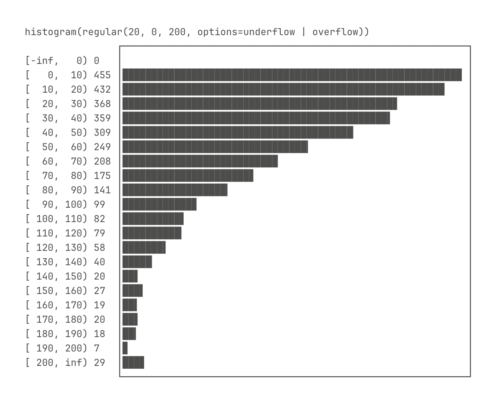
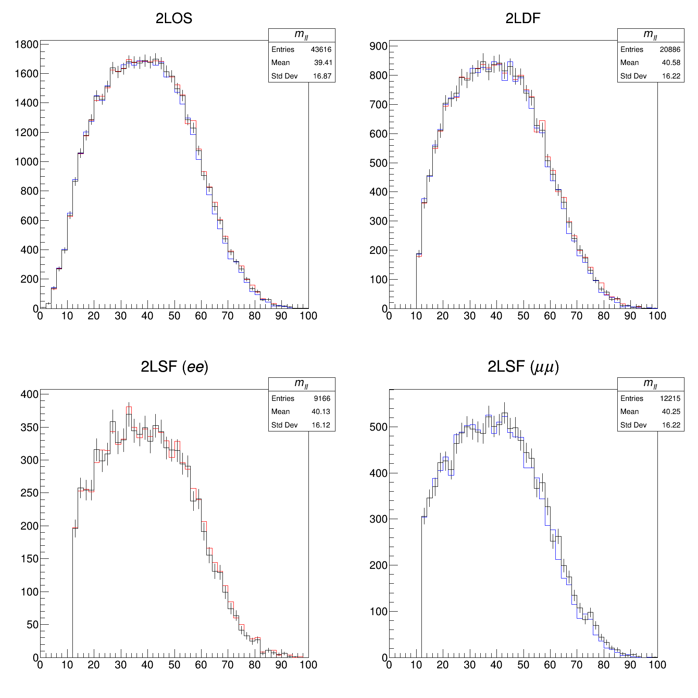
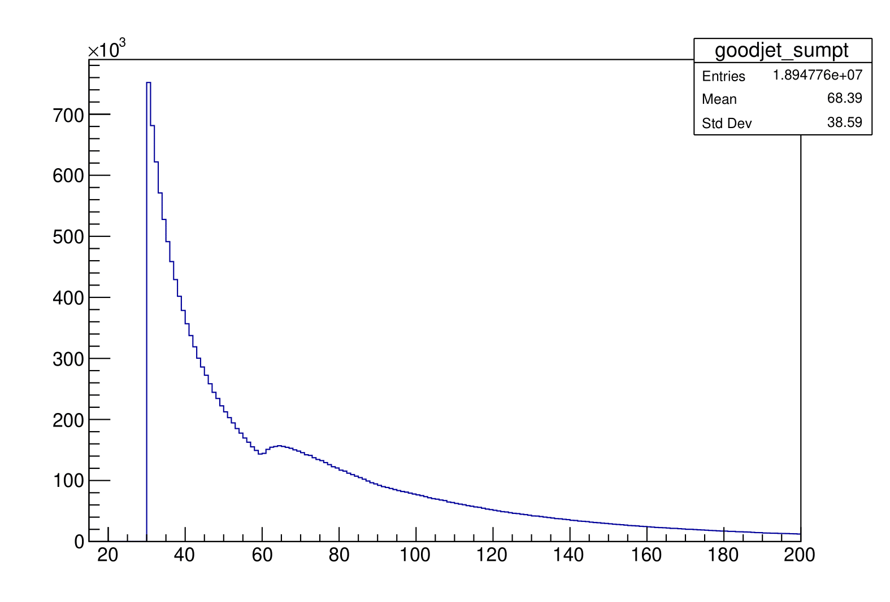
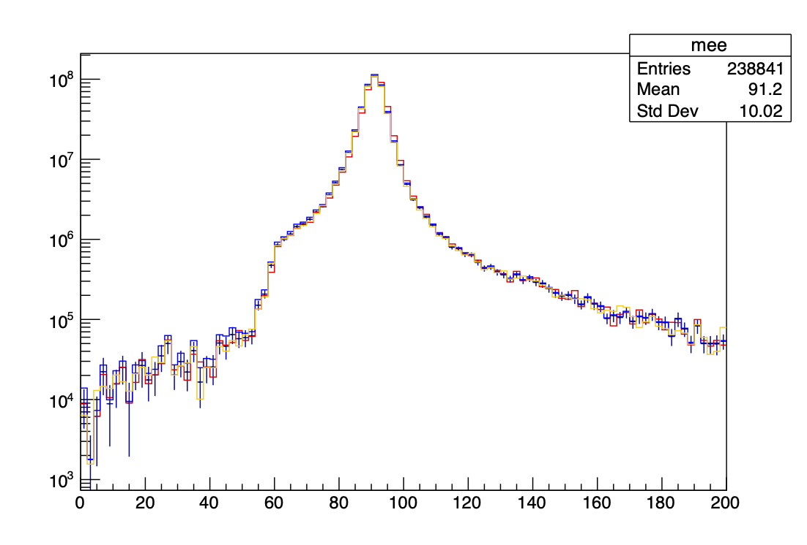

# Examples

```{toctree}
:maxdepth: 1
:hidden:

hello.md
hww.md
xaod.md
iris.md
```

## Full examples

- The basic example loads a [nlohmann::json](https://github.com/nlohmann/json) to output a [boost::histogram](https://www.boost.org/doc/libs/1_85_0/libs/histogram/doc/html/index.html).
- Extensions for [ROOT](https://root.cern/) objects are provided by [AnaQuery](https://github.com/taehyounpark/AnaQuery).

::::{grid} 2
:gutter: 2

:::{grid-item-card}
:link: https://queryosity.readthedocs.io/en/latest/examples/hello.html

+++
Basic example
:::
:::{grid-item-card}
:link: https://queryosity.readthedocs.io/en/latest/examples/hww.html

+++
`TTree` + systematic variations
:::
:::{grid-item-card}
:link: https://queryosity.readthedocs.io/en/latest/examples/iris.html

+++
IRIS-HEP ADL benchmark
:::
:::{grid-item-card}
:link: https://gitlab.cern.ch/tapark/MyAnalysis/-/blob/master/utils/mee.cxx?ref_type=heads

+++
ATLAS `xAOD` + systematic variations
:::
::::
