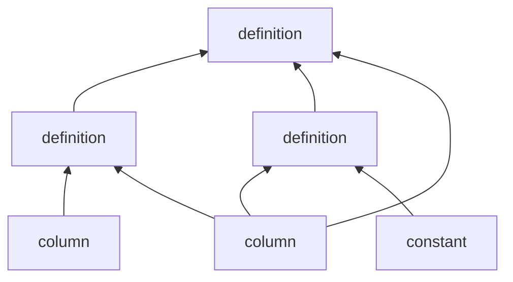

Computing quantities of interest out of existing column values in an entry may be a complicated task.

Some desirable properties of the computation graph guaranteed by analogical:

- No circular loops.
- The value of a column is computed at most once per-entry, only if needed.
- Column values are not copied when used as inputs for others.
    - Only if a conversion is required, the value is copied.