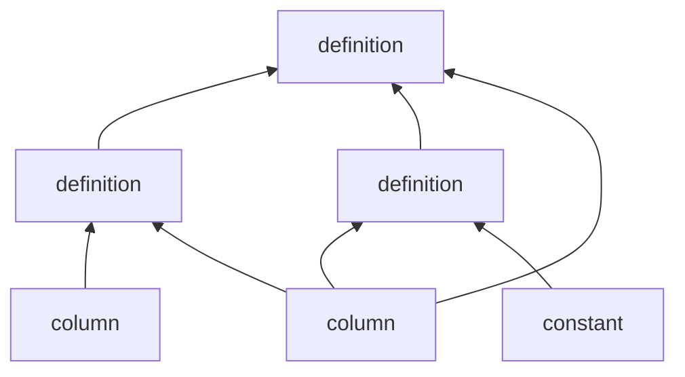

Computing quantities of interest out of existing column values in an entry may be a complicated task.

The following properties of the computation graph are guaranteed by the interface:

- No circular loops.
- Each column value is computed at most once per-entry, only if needed.
- No column values are copied when used as inputs for definitions.
    - The value *is* copied if an implicit conversion is required.