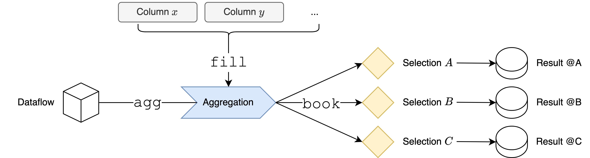

A `counter` defines an action that:

- Executes an arbitrary action (as implemented) under a particular selection, i.e. only if the cut has passed.
    -  (Optional) Takes into account the selection weight.
- (Optional) Populates the counter result based on values of input columns per-entry.
- Outputs the result once the full dataset has been traversed.

In particular, given a definition of the concrete counter and input columns, it can be booked under multiple selections at a time.

Similarly, from a single selection, it is possible to book multiple different results:

