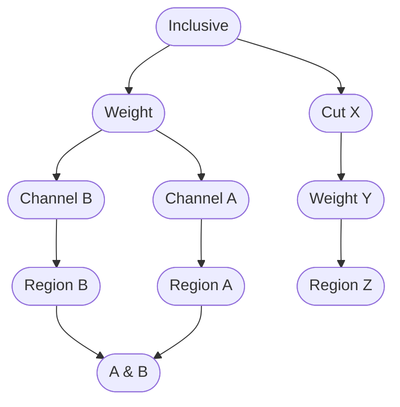

```mermaid
graph TB
  A([Inclusive]) --> B([Weight]);

  B --> D([Channel B]);
  D --> D2([Region B]);

  B --> C([Channel A]);
  C --> C2([Region A]);

  D2 --> D2C2(["A & B"]);
  C2 --> D2C2;

  A --> F([Cut X]);
  F --> G([Weight Y]);
  G --> H([Region Z]);
```