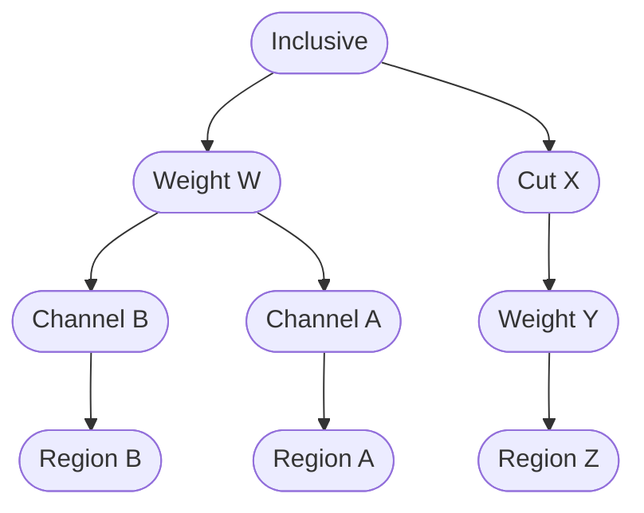

Let's see how ("easily") such an arbitrary cutflow structure can be expressed with a dataflow:
```{ .cpp .annotate }

auto cut_inclusive = df.filter("inclusive")(inclusive);

// first branch
auto weighted = inclusive.weight("weighted")(w);
// channels
auto channel_a = weighted.channel("a")(a);
auto channel_b = weighted.channel("b")(b);
// regions
auto region_a = channel_a.filter("region")(r);
auto region_b = channel_b.filter("region")(r);

// second branch
auto region_z = inclusive.filter("x")(x).weight("y")(y).filter("z")(z);
```

To see what exactly a `channel()` call did different versus a regular `filter()`, one can do:
```cpp
std::cout << region_a.get_path() << std::endl;  // "a/region"
std::cout << region_b.get_path() << std::endl;  // "b/region"
```
Note that the "path" of a selection at the downstream selections inherit the names of the channels as prefixes.