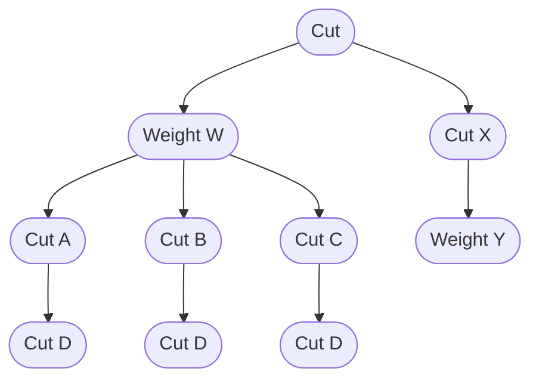

A `selection` applied on entries refers to either:

- A boolean decision as a `cut` to determine if the entry should be considered or not.
- A floating-point value as a `weight` to assign a statistical significance to the entry.

An arbitrary sequence of selections can be applied such that they are compounded:

- A series of two or more cuts is equivalent to their logical and, `&&`.
- A series of two or more weights is equivalent to their product, `*`.

Any combination of cuts and weights can be applied in any order, and any number of arbitrary selections share a common pre-selection.
For example:

1. Start out from some common preselection of entries.
2. Branch out to (left) apply a weight to all preselected entries, or (right) apply an additional cut.
4. On the left, apply three different cuts A, B, and C, then apply a common cut D on each. 
3. On the right, apply a weight whose value is only defined for entries passing the upstream cut.

This logical structure is referred to as a "cutflow" which can be represented as a tree:

Any arbitrary cutflow can be created in `analogical`.