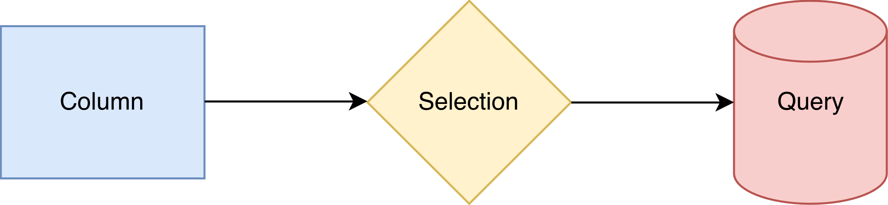

@page conceptual Conceptual guide
@tableofcontents

@section conceptual-dataflow Dataflow

A `dataflow` consists of a directed, acyclic graph of tasks performed for each entry.

An action falls into one of three types that reflect the nature of the task and are uniquely associated with a set of applicable methods.
Each type forms a sub-graphs of tasks, which receive actions of the previous types as inputs:

| Action | Description | Methods | Description | Task Graph | Input actions |
| :--- | :-- | :-- | :-- | :-- | :-- | 
| `column` | Quantity of interest | `read()` | Read a column. | Computation | -- |
| | | `define()` | Evaluate a column. | | |
| `selection` | Boolean decision | `filter()` | Apply a cut. | Cutflow | `column` |
| | Floating-point decision | `weight()` | Apply a statistical significance. | | |
| `query` | Perform a query | `make()` | Make a query plan. | Experiment | `column` & `selection` |
| | | `fill()` | Populate with column value(s). | | |
| | | `book()` | Perform over selected entries. | | |

@section conceptual-lazy Lazy actions

All actions are "lazy", meaning they are not executed them unless required.
Accessing the result of any query, which requires any of its associated actions to be performed over the entire dataset, turns them "eager".
Once the dataset traversal is underway for any one query, all existing queries for the dataflow up to that point are also processed.
The eagerness of actions in each entry are as follows:

1. A query is executed only if its associated selection passes its selection.
2. A selection is evaluated only if all of its prior selections in the cutflow have passed.
3. A column is evaluated only if it is needed to determine any of the above.

@section conceptual-columns Columns

A `column` contains some data type `T` whose value changes, i.e. must be updated, for each entry.
The computation graph only needs to perform the least number of updates possible:

- A column value is updated for an entry only if its computation is required.
    - Once updated, the value is cached and never re-computed.
- A column value is not copied when used as an input for dependent columns.
    - It *is* copied a conversion is required.

@section conceptual-selections Selections

A `selection` is a specific type of scalar-valued columns representing a decision made on an entry:

- A boolean as a `cut` to determine if the entry should be counted in a query or not.
    - A series of two or more cuts is equivalent to their intersection, `&&`.
- A floating-point value as a `weight` to assign a statistical significance to the entry.
    - A series of two or more weights is equivalent to their product, `*`.

A cutflow can have from the following types connections between nodes:

- Applying a selection from an existing node, which determines the order in which they are compounded.
- Branching selections by applying more than one selection from a common node.
- Merging two selections, e.g. taking the union/intersection of two cuts.

#### Algorithmic guarantees

- The cut at a node will first check to see if its previous cut has passed.
- The weight at a selection node is not evaluated unless the cut has passed.
- Once a decision is evaluated at a node,

@section conceptual-query Queries

A `query` definition specifies an output whose result is obtained from counting entries of the dataset.

- The query definition dictates how an entry is to be counted, i.e. it is an arbitrary action:
    - (Optional) The result is populated based on values of inputs columns.
    - In multithreaded runs, it must also merge outputs from individual threads to yield a result representative of the full dataset.

- A query definition must be associated with a selection whose cut determines which entries to count.
    - (Optional) The result is populated with the weight taken into account.

Two common workflows exist in associating queries with selections:

- Running a single query at multiple selections:

- Running multiple queries at a selection:

@section conceptual-variations Systematic variations

A sensitivity analysis means to study how changes in the input of a system affect its output. In the context of dataset queries, a **systematic variation** constitutes a __change in a column value that affects the outcome of selections and queries__.

In a dataflow, variations in a column need only be specified *once*. 
Then, they are *propagated* through all relevant task graphs.
This reduces code redundancy i.e. room for human error, and ensures that all variations run in a single run, eliminating the runtime overhead associated with repeated dataset traversals.

This is done by encapsulating the nominal and variations of a column to create a `varied` node in which each variation is mapped by the name of its associated systematic variation.
A varied node can be treated functionally identical to a nominal-only one, with all nominal+variations being propagated underneath:

- Any column definitions and selections evaluated out of varied input columns will be varied.
- Any queries performed filled with varied input columns and/or at varied selections will be varied.

The propagation proceeds in the following fashion:

- **Lockstep.** If two actions each have a variation of the same name, they are in effect together.
- **Transparent.** If only one action has a given variation, then the nominal is in effect for the other.

