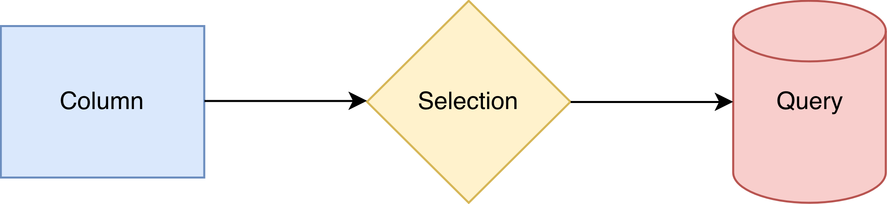
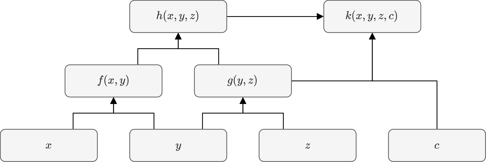
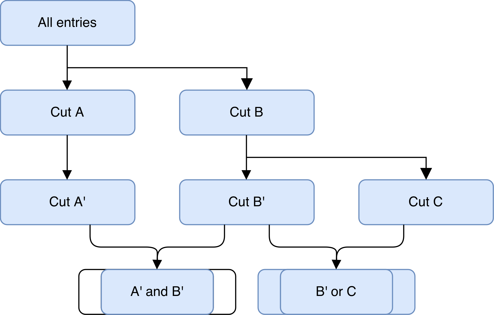

# Conceptual overview

## Dataflow

Dataflow
: A directed, acyclic graph of task performed for each entry of a tabular dataset.
  

Action
: A node in the dataflow belonging to one of three task sub-graphs.

***

Actions of each task sub-graph belongs to its own sub-type, and can receive actions from the previous graph(s) as inputs:

| Action | Description | Methods | Description | Task Graph | Inputs |
| :--- | :-- | :-- | :-- | :-- | :-- | 
| `column` | Quantity of interest | `read()` | Read a column. | Computation |  |
| | | `define()` | Compute a column. | | `column` |
| `selection` | Boolean decision | `filter()` | Apply a cut. | Cutflow | `column` |
| | Floating-point decision | `weight()` | Apply a statistical significance. | | `column` |
| `query` | Perform a query | `get()` | Define an output. | Experiment | |
| | | `fill()` | Populate with column value(s). | | `column` |
| | | `at()` | Run over selected entries. | | `selection` |
| | | `result()` | Get the result. | | |

## Lazy actions

Lazy action
: An action that is not performed, i.e. initialized/executed/finalized, unless requested by the user.

***

Accessing the result of a lazy query turns it and all other actions *eager*, triggering the dataset traversal.
The eagerness of actions in each entry is as follows:

1. A query is performed only if its associated selection passes the cut.
2. A selection is evaluated only if all prior cuts in the cutflow have passed.
3. A column is evaluated only if it is needed to determine any of the above.

## Columns

Column
: An action that holds a value of some data type `T` to be updated for each entry.

Independent column
: A column whose value does not depend on others

Dependent column
: A column whose value is evaluated out of those from other columns as inputs.

***

The tower of dependent columns can be constructed to form the computation graph:

:::{card}
:text-align: center

+++
Example computation graph.
:::

Only the minimum number of computations needed are performed for each entry:
- A column value is computed *once* for an entry (if needed), then cached and never re-computed.
- A column value is not copied when used as an input for dependent columns (unless a conversion is needed).

## Selections

Selection
: A scalar-valued column corresponding to a "decision" on an entry:
  - A boolean `cut` to determine if a query should be performed for the entry.
    - A series of two or more cuts becomes their intersection, `and`
  - A floating-point `weight` to assign a statistical significance to the entry.
    - A series of two or more weights becomes to their product, `*`.
  - A cut is referred to as being *complementary* to weight and vice versa.

***

A cutflow can contain the following types of connections between selections:

- Applying a selection from an existing node, which determines the order in which they are compounded.
- Branching selections by applying more than one selection from a common node.
- Merging two selections, e.g. taking the union/intersection of two cuts.

:::{card}
:text-align: center

+++
Example cutflow.
:::

Selections constitute a specific type of columns, so they are subject to the lazy-evaluation and value-caching behaviour of the computation graph.
Addditionally, the cutflow imposes the following rules:
- The cut at a selection is evaluated only if all previous cuts have passed.
- The weight at a selection is evaluated only if its cut has passed.

## Queries

Query
: An action that outputs result of some data type `T` after traversing the dataset.
  - It must be associated with a selection whose cut determines which entries to count.
    - (Optional) The result is populated with the weight taken into account.
  - How the query counts an entry is a user-implemented arbitrary action.
    - (Optional) The result is populated based on values of inputs columns.

***

:::{card}
:text-align: center
```{image} ../images/query_1.png
+++
Making, filling, and booking a query.
:::

## Systematic variations

Systematic variation
: A change in a column value that affects the outcomes of associated selections and queries.

***

A sensitivity analysis means to study how changes in the system's inputs affect its output. 
In the context of a dataflow, the inputs are column values and outputs are query results.

The nominal and variations of a column can be encapsulted within a *varied* node, which can be treated functionally identical to a nominal-only one except that all nominal+variations are propagated through downstream actions implicitly:

- Any column definitions and selections evaluated out of varied input columns will be varied.
- Any queries performed with varied input columns and/or at varied selections will be varied.

The propagation proceeds in the following fashion:

- **Lockstep.** If two actions each have a variation of the same name, they are in effect together.
- **Transparent.** If only one action has a given variation, then the nominal is in effect for the other.

All variations are processed at once in a single dataset traversal; in other words, they do not incur any additional runtime overhead other than what is needed to perform the actions themselves.

:::{card}
:text-align: center
```{image} ../images/variation.png
```
+++
Propagation of systematic variations on $z = x+y$.
:::

@see @ref guide